## 推定時間：60分

## タスク 1 - 自分のリソース グループを確認する

> 注：リソース グループは、講師があらかじめ作成しています。**自分で作成する必要はありません。** 受講者のアカウントには、講師が用意したサブスクリプションだけが見えるように権限を付けています（他の人の環境や、研修と関係のない環境が見えないようにするためです）。

1. Azure Portal (https://portal.azure.com) にサインインします。

2. 「ホーム」の「Azure サービス」から [リソース グループ] をクリックします。

    > 注：一覧に表示されていない場合は、上部の「リソース、サービス、ドキュメントの検索」に `リソース グループ` と入力して選択します。

    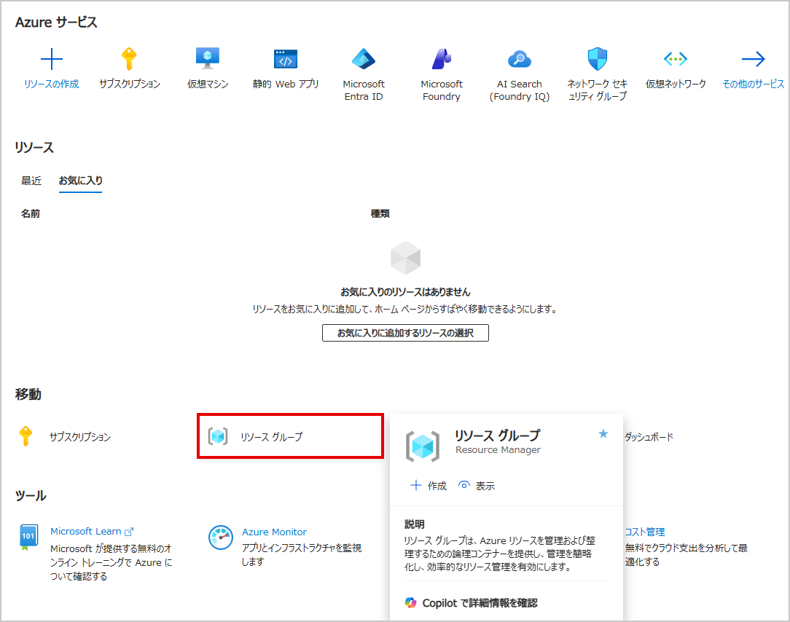

3. 「Resource Manager | リソース グループ」画面で、以下を確認します。

    | 項目 | 値 |
    |---|---|
    | サブスクリプション | 講師が用意したサブスクリプション（1 つだけ表示されます） |
    | リソース グループ名 | rg-intern-YYMMDD-NN |
    | リージョン | Japan East |

    > 注：`YYMMDD` は実施日、`NN` は自分の番号です。講師から伝えられた名前と一致していることを確認してください。
    > 例：2026 年 10 月 27 日に実施し、番号が 03 の場合は `rg-intern-261027-03` となります。
    > 以降の手順でも同じ規則で置き換えます。

    > 注：自分の名前のリソース グループが表示されない場合、またはサブスクリプションが 1 つも表示されない場合は、先へ進まずに講師に伝えてください。

    <!-- lab01-05.png は差し替え予定：割り当て済みのリソース グループが表示されている画面 -->
    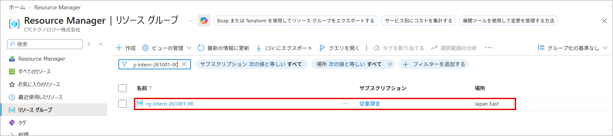

4. 以降の手順で作成するものは、すべてこのリソース グループに入れます。「リソース グループ」の選択欄では、必ず自分の `rg-intern-YYMMDD-NN` を選んでください。

## タスク 2 - 仮想ネットワークを作成する

1. Azure Portal 上部の検索バーに `仮想ネットワーク` と入力し、検索候補の「サービス」欄から [仮想ネットワーク] を選択します。

    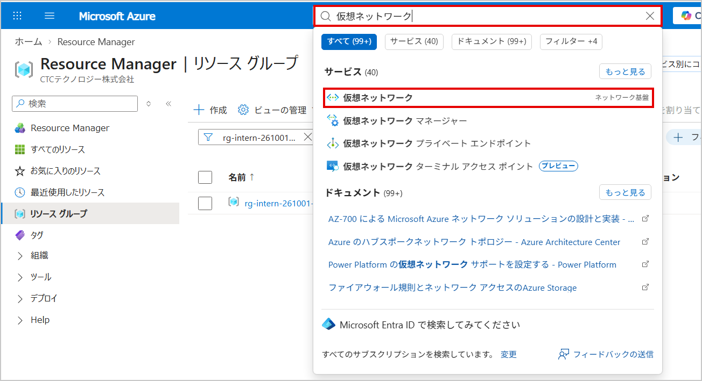

2. 「ネットワーク基盤 | 仮想ネットワーク」画面で、[＋ 作成] をクリックします。

    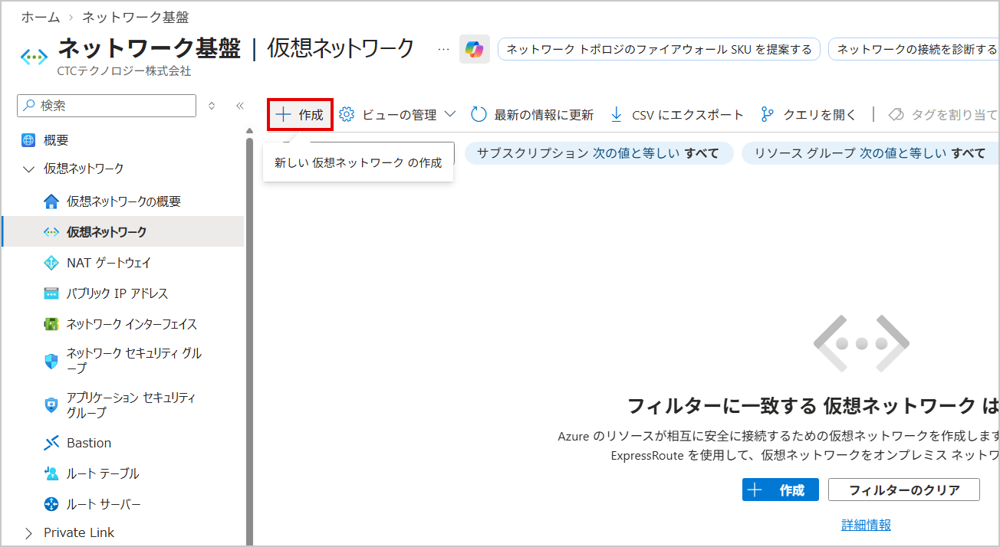

3. 「仮想ネットワークの作成」画面の [基本情報] タブで、以下を設定します。

    | 項目 | 値 |
    |---|---|
    | サブスクリプション | 講師が用意したサブスクリプション |
    | リソース グループ | rg-intern-YYMMDD-NN |
    | 仮想ネットワーク名 | vnet-intern-YYMMDD-NN |
    | リージョン | (Asia Pacific) Japan East |

    > 注：「リソース グループ」は一覧から、タスク 1 で確認した自分の `rg-intern-YYMMDD-NN` を選択してください。

    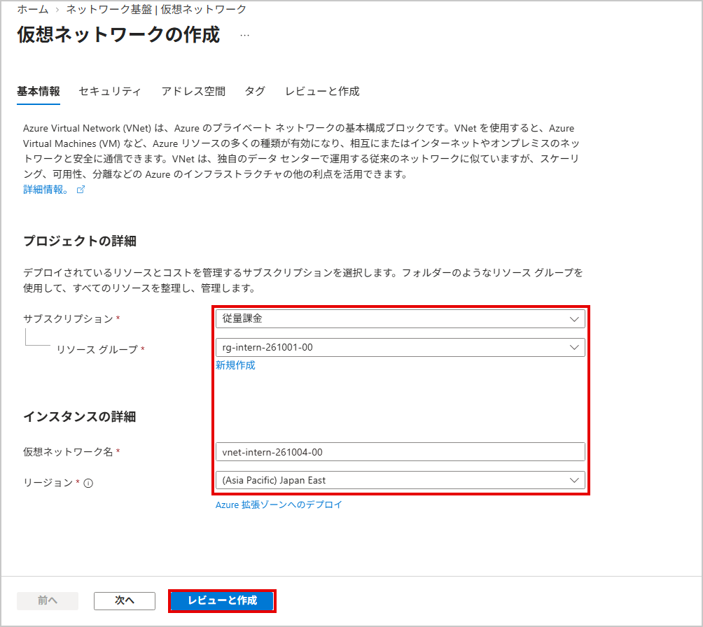

4. [次へ] をクリックし、[セキュリティ] タブに進みます。

5. [セキュリティ] タブで、以下がすべてチェックなし（既定値）であることを確認します。

    | 項目 | 値 |
    |---|---|
    | 仮想ネットワークの暗号化 | チェックなし |
    | Azure Bastion を有効にする | チェックなし |
    | Azure Firewall を有効にする | チェックなし |

    > 注：いずれも有料のオプション機能です。今回は使用しないため、既定値のまま進みます。

    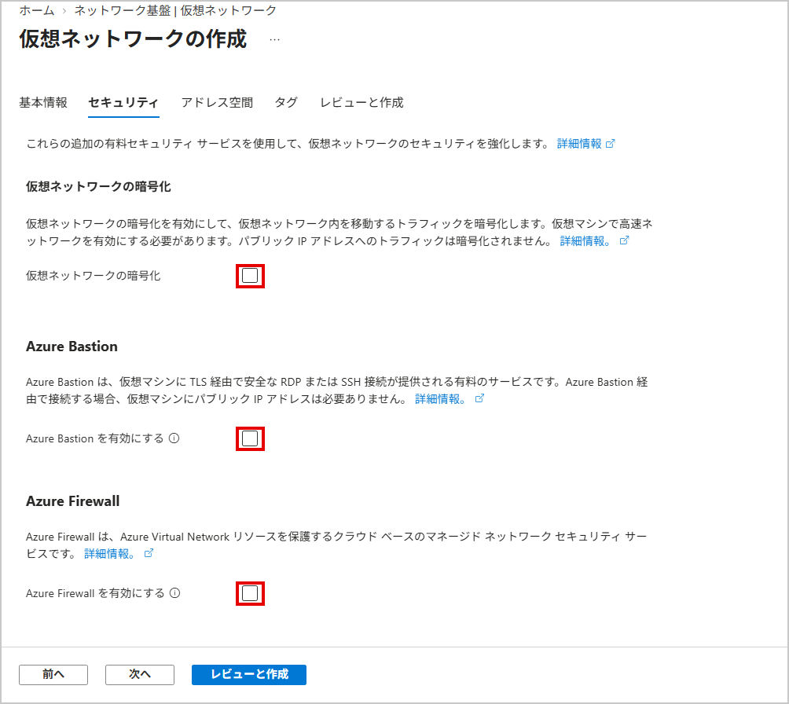

6. [次へ] をクリックし、[アドレス空間] タブに進みます。

7. [アドレス空間] タブで、既定のアドレス空間（10.0.0.0/16）を、以下の値に書き換えます。

    | 項目 | 値 |
    |---|---|
    | アドレス空間 | 10.100.0.0/16 |

    > 注：この値は、承認された設計書（第 1 部）で決めたものです。お客様の既存の社内ネットワーク（10.10.0.0/16、10.20.0.0/16、10.30.0.0/16）と重ならない範囲を選んでいます。

    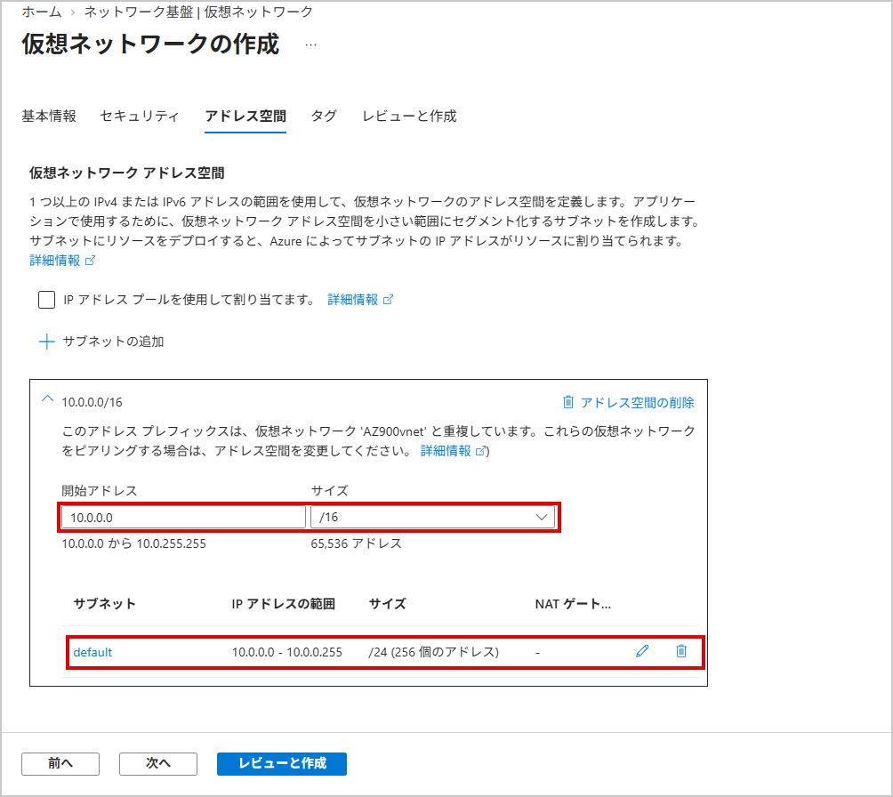

8. サブネット一覧の「default」をクリックし、「サブネットの編集」画面を開きます。

9. 以下のとおり設定します。

    | 項目 | 値 |
    |---|---|
    | サブネットの目的 | Default |
    | 名前 | snet-web-01 |
    | 開始アドレス | 10.100.1.0 |
    | サイズ | /24 (256 個のアドレス) |
    | プライベート サブネットを有効にする | チェックを外す |

    > 注：このサブネットは、設計書の「区切り①」（Web サーバーを置く側）です。
    > 注：「プライベート サブネットを有効にする」が有効のままだと、VM が既定でインターネットに送信接続できません（2026年3月31日以降、新規VNetの既定仕様として追加された項目です）。Lab04 で nginx のインストールや AI Foundry への通信を行うため、必ずチェックを外してください。

    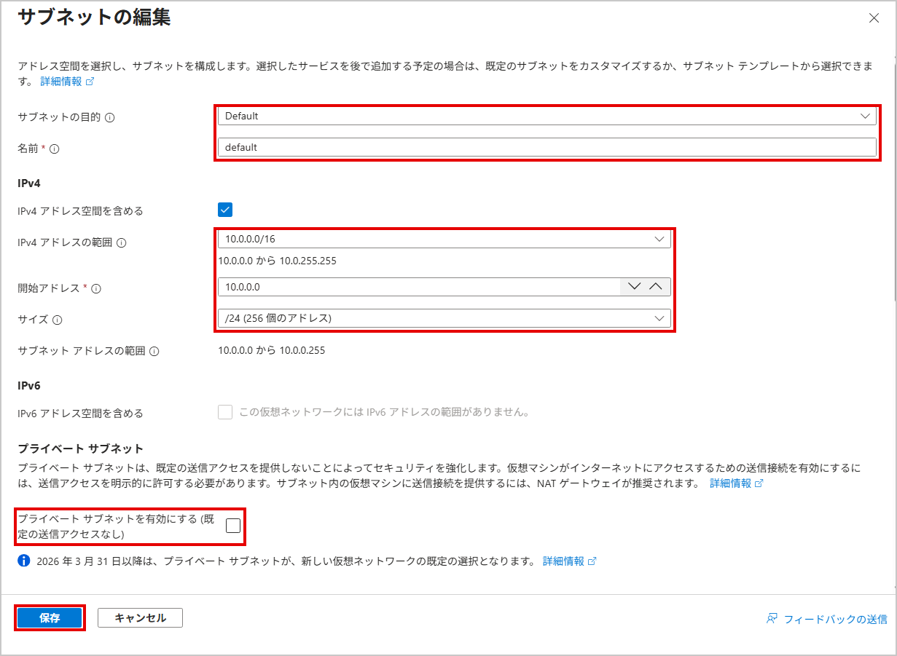

10. [保存] をクリックします。

11. [＋ サブネットの追加] をクリックし、以下のとおり設定して [追加] をクリックします。

    | 項目 | 値 |
    |---|---|
    | サブネットの目的 | Default |
    | 名前 | snet-spare-01 |
    | 開始アドレス | 10.100.2.0 |
    | サイズ | /24 (256 個のアドレス) |
    | プライベート サブネットを有効にする | チェックを外す |

    > 注：このサブネットは、設計書の「区切り②」（将来の拡張用）です。本研修では、サーバーを置かず、使いません。

    <!-- 区切り②の追加画面（lab01-11b.png）を撮影予定 -->

12. サブネット一覧に、以下の 2 つが表示されていることを確認します。

    | 名前 | 範囲 |
    |---|---|
    | snet-web-01 | 10.100.1.0/24 |
    | snet-spare-01 | 10.100.2.0/24 |

13. [タグ] タブに移動します。何も入力せず、そのまま [レビューと作成] タブに進みます。

14. 「検証に成功しました」と表示されることを確認し、以下の内容を確認します。

    | 項目 | 値 |
    |---|---|
    | サブスクリプション | 講師が用意したサブスクリプション |
    | リソース グループ | rg-intern-YYMMDD-NN |
    | 名前 | vnet-intern-YYMMDD-NN |
    | Azure リージョン | Japan East |
    | Azure Bastion | 無効 |
    | Azure Firewall | 無効 |
    | Azure DDoS ネットワーク保護 | 無効 |
    | アドレス空間 | 10.100.0.0/16 (65,536 個のアドレス) |
    | サブネット | snet-web-01 (10.100.1.0/24)、snet-spare-01 (10.100.2.0/24) |

    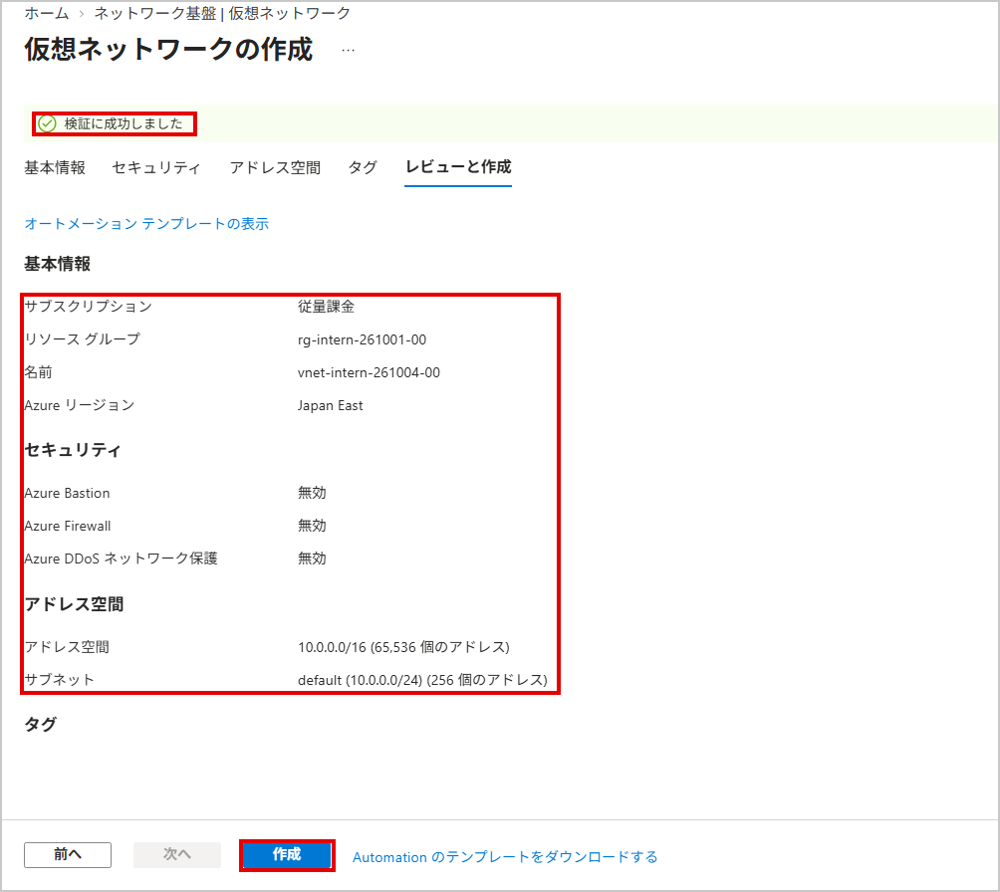

15. [作成] をクリックします。

16. 「デプロイが完了しました」と表示されるまで待ちます。

17. [リソースに移動] をクリックし、「概要」画面で以下が反映されていることを確認します。

    | 項目 | 値 |
    |---|---|
    | リソース グループ | rg-intern-YYMMDD-NN |
    | 場所 | Japan East |
    | アドレス空間 | 10.100.0.0/16 |
    | サブネット | 2 個のサブネット |

    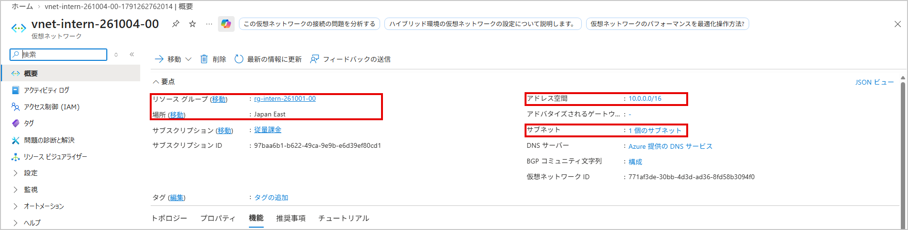

## タスク 3 - ネットワーク セキュリティ グループを作成する

1. Azure Portal 上部の検索バーに `ネットワークセキュリティグループ` と入力し、検索候補の「サービス」欄から [ネットワーク セキュリティ グループ] を選択します。

    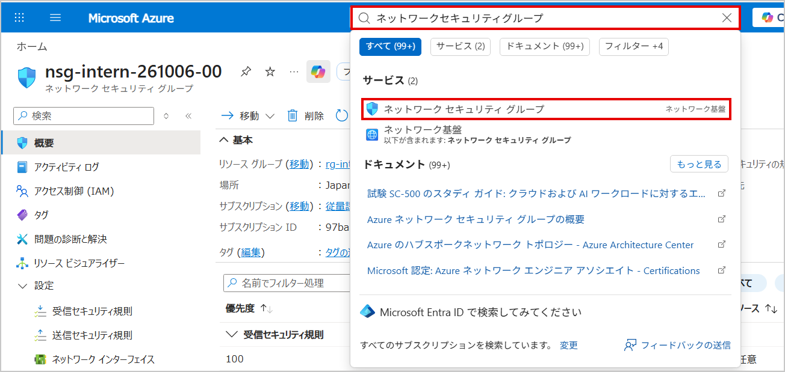

2. 「ネットワーク基盤 | ネットワーク セキュリティ グループ」画面で、[＋ 作成] をクリックします。

    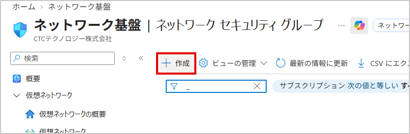

3. 「ネットワーク セキュリティ グループの作成」画面の [基本] タブで、以下を設定します。

    | 項目 | 値 |
    |---|---|
    | サブスクリプション | 講師が用意したサブスクリプション |
    | リソース グループ | rg-intern-YYMMDD-NN |
    | 名前 | nsg-intern-YYMMDD-NN |
    | リージョン | Japan East |

    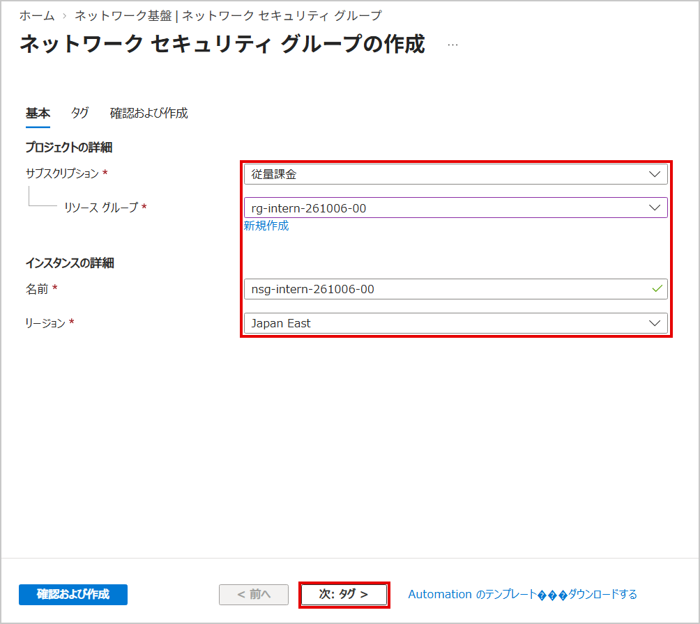

4. [次: タグ >] をクリックします。

5. [タグ] タブに移動します。何も入力せず、そのまま [次: 確認および作成 >] をクリックします。

    > 注：この画面のボタン表記は「確認および作成」です（VNetやリソースグループの「確認と作成」とは異なる表記なので注意してください）。

6. [確認および作成] タブで、「検証に成功しました」と表示されることを確認し、以下の内容を確認します。

    | 項目 | 値 |
    |---|---|
    | サブスクリプション | 講師が用意したサブスクリプション |
    | リソース グループ | rg-intern-YYMMDD-NN |
    | リージョン | Japan East |
    | 名前 | nsg-intern-YYMMDD-NN |

    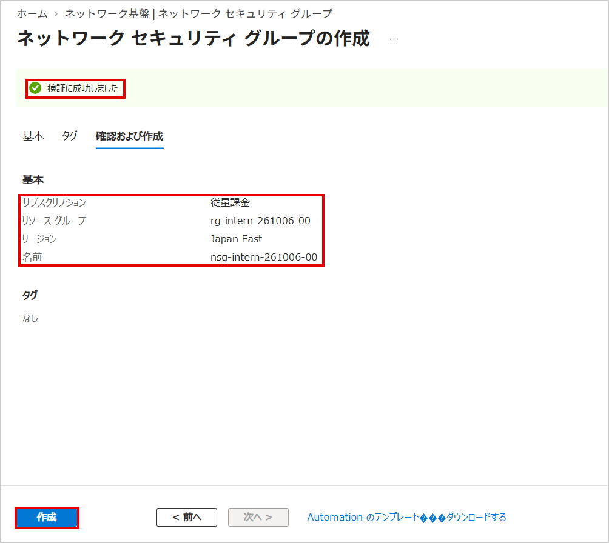

7. [作成] をクリックします。

8. 「デプロイが完了しました」と表示されるまで待ちます。

    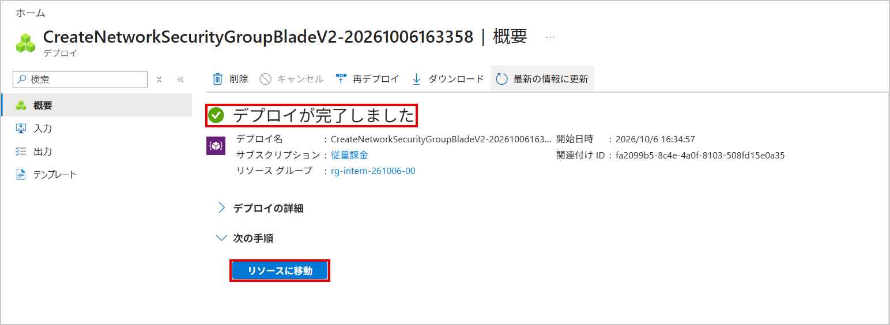

9. [リソースに移動] をクリックし、「概要」画面で、既定のセキュリティ規則が以下のとおり作成されていることを確認します。

    **受信セキュリティ規則**

    | 優先度 | 名前 | ポート | プロトコル | ソース | 宛先 | アクション |
    |---|---|---|---|---|---|---|
    | 65000 | AllowVnetInBound | 任意 | 任意 | VirtualNetwork | VirtualNetwork | Allow |
    | 65001 | AllowAzureLoadBalancerInBound | 任意 | 任意 | AzureLoadBalancer | 任意 | Allow |
    | 65500 | DenyAllInBound | 任意 | 任意 | 任意 | 任意 | Deny |

    **送信セキュリティ規則**

    | 優先度 | 名前 | ポート | プロトコル | ソース | 宛先 | アクション |
    |---|---|---|---|---|---|---|
    | 65000 | AllowVnetOutBound | 任意 | 任意 | VirtualNetwork | VirtualNetwork | Allow |
    | 65001 | AllowInternetOutBound | 任意 | 任意 | 任意 | Internet | Allow |
    | 65500 | DenyAllOutBound | 任意 | 任意 | 任意 | 任意 | Deny |

    > 注：この時点では、SSH（ポート22）や HTTP（ポート80）の通信は許可されていません。この後の手順で受信規則を追加します。

    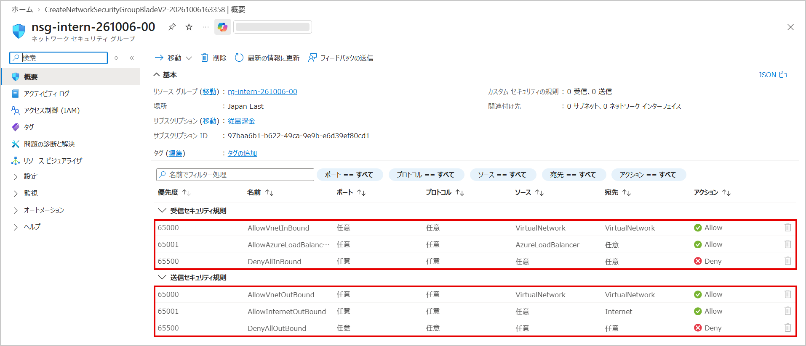

## タスク 4 - 受信セキュリティ規則を追加する（HTTP・SSH）

1. NSG「nsg-intern-YYMMDD-NN」の「概要」画面で、左側メニューの [設定] を展開し、[受信セキュリティ規則] をクリックします。

    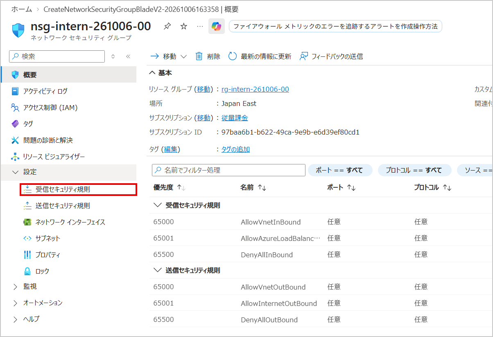

2. 既定の3規則（AllowVnetInBound、AllowAzureLoadBalancerInBound、DenyAllInBound）のみが表示されていることを確認します。

    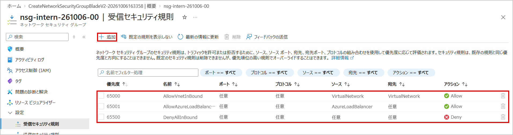

3. [＋ 追加] をクリックします。

4. 「受信セキュリティ規則の追加」画面で、以下を設定します。

    | 項目 | 値 |
    |---|---|
    | ソース | Any |
    | ソース ポート範囲 | * |
    | 宛先 | Any |
    | サービス | HTTP |
    | 宛先ポート範囲 | 80（自動入力） |
    | プロトコル | TCP（自動選択） |
    | アクション | 許可 |
    | 優先度 | 100 |
    | 名前 | AllowHTTP |

    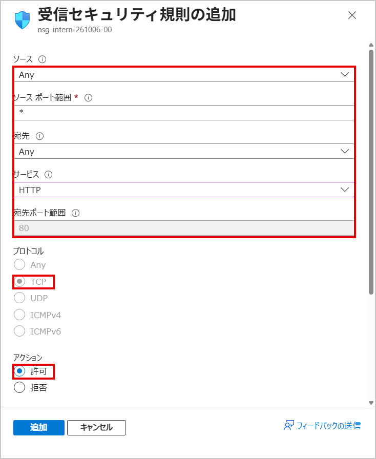

    

5. [追加] をクリックします。

6. 再度 [＋ 追加] をクリックし、以下を設定します。

    | 項目 | 値 |
    |---|---|
    | ソース | Any |
    | ソース ポート範囲 | * |
    | 宛先 | Any |
    | サービス | SSH |
    | 宛先ポート範囲 | 22（自動入力） |
    | プロトコル | TCP（自動選択） |
    | アクション | 許可 |
    | 優先度 | 110 |
    | 名前 | AllowSSH |

    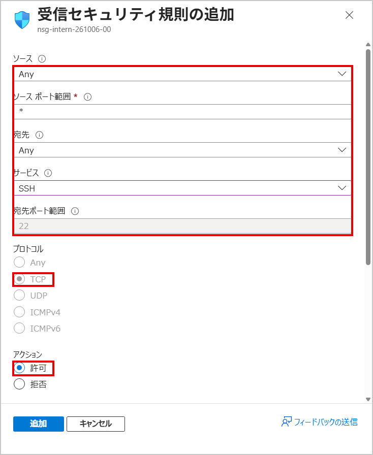

    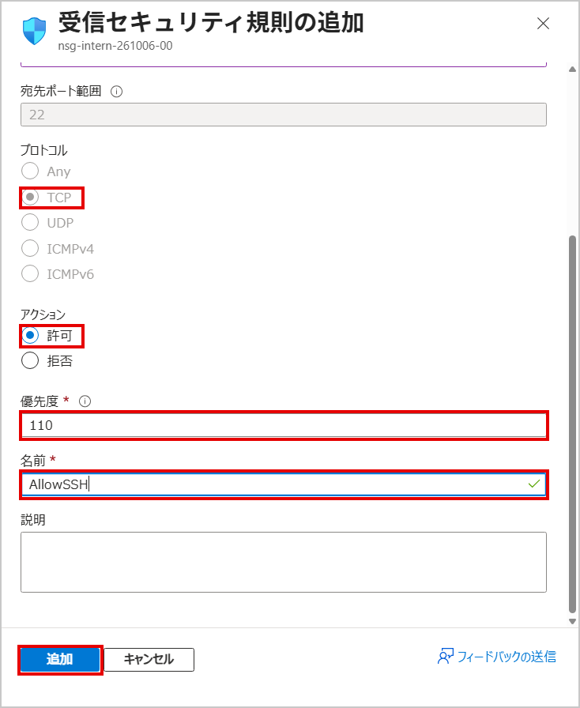

7. [追加] をクリックします。

8. 受信セキュリティ規則の一覧に、以下の5件が表示されていることを確認します。

    | 優先度 | 名前 | ポート | プロトコル | ソース | アクション |
    |---|---|---|---|---|---|
    | 100 | AllowHTTP | 80 | TCP | 任意 | Allow |
    | 110 | AllowSSH | 22 | TCP | 任意 | Allow |
    | 65000 | AllowVnetInBound | 任意 | 任意 | VirtualNetwork | Allow |
    | 65001 | AllowAzureLoadBalancerInBound | 任意 | 任意 | AzureLoadBalancer | Allow |
    | 65500 | DenyAllInBound | 任意 | 任意 | 任意 | Deny |

    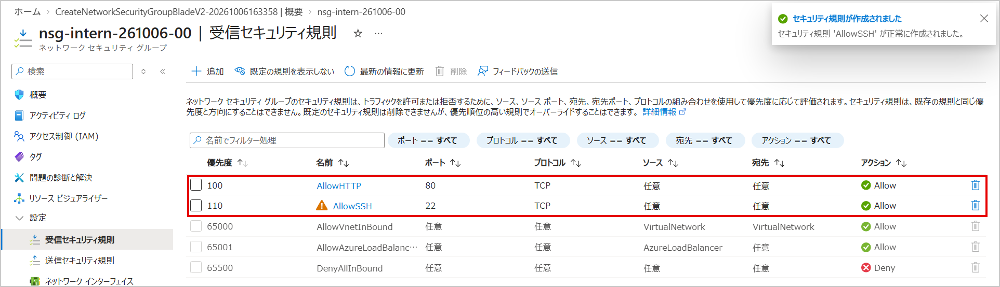

    > 注：「AllowSSH」の名前の左に注意アイコンが表示されます。これは、ソースを「Any」（すべてのIPアドレス）からのSSH接続を許可しているためです。本研修では学生が社外から接続するため許容しますが、実運用では接続元を絞り込むのが望ましいという点を補足しておくとよいでしょう。

## タスク 5 - サブネットに NSG を関連付ける

1. NSG「nsg-intern-YYMMDD-NN」の左側メニューで [サブネット] をクリックします。

2. 「結果なし。」と表示されていることを確認します（まだ関連付けられていない状態です）。

    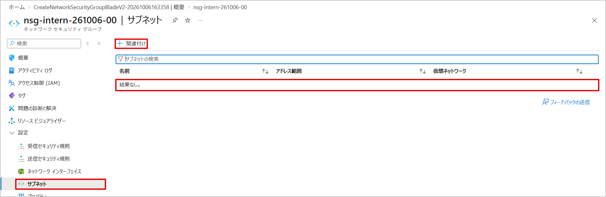

3. [＋ 関連付け] をクリックします。

4. 「サブネットの関連付け」画面で、以下を設定します。

    | 項目 | 値 |
    |---|---|
    | 仮想ネットワーク | vnet-intern-YYMMDD-NN (rg-intern-YYMMDD-NN) |
    | サブネット | snet-web-01 |

    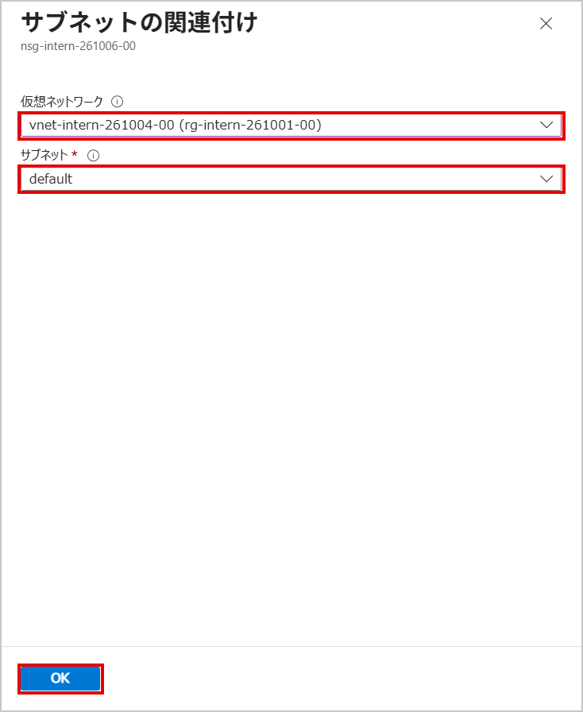

5. [OK] をクリックします。

6. 「サブネットを保存しています」という通知が表示され、サブネット一覧に以下が表示されることを確認します。

    | 名前 | アドレス範囲 | 仮想ネットワーク |
    |---|---|---|
    | snet-web-01 | 10.100.1.0/24 | vnet-intern-YYMMDD-NN |

    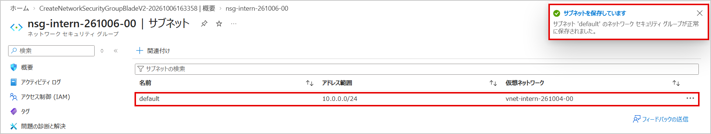

これでLab01（タスク1〜5：リソースグループの確認・VNet・NSG・受信規則・サブネット関連付け）は完成です。

> 注：ここで作ったものは、承認された設計書（第 1 部）と同じ値です（アドレス空間 10.100.0.0/16、区切り① 10.100.1.0/24、区切り② 10.100.2.0/24）。ワークブック Day3 の「設定値の記録」に、実際の値を書き留めてください。
