## 推定時間：60分

## タスク 1 - 仮想マシンを作成する

1. Azure Portal 上部の検索バーに `仮想マシン` と入力し、検索候補の「サービス」欄から [仮想マシン] を選択します。

    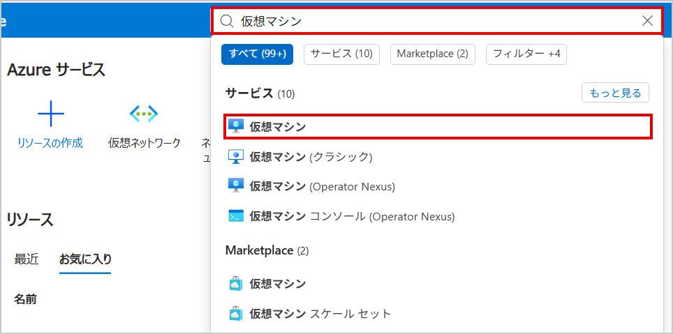

2. 「コンピューティング インフラストラクチャ | 仮想マシン」画面で、[＋ 作成] の [仮想マシン] をクリックします。

    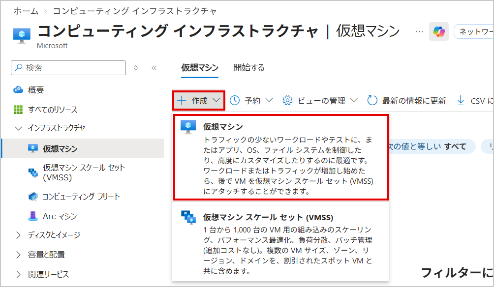

3. 「仮想マシンの作成」画面の [基本情報] タブで、以下を設定します。

    | 項目 | 値 |
    |---|---|
    | サブスクリプション | 従量課金 |
    | リソース グループ | rg-intern-YYMMDD-NN |
    | 仮想マシン名 | vm-intern-YYMMDD-NN |
    | リージョン | (Asia Pacific) Japan East |

    > 注：この画面は「新しい Create-VM エクスペリエンスのプレビュー」です。画面上部にプレビュー版である旨の案内が表示されます。

    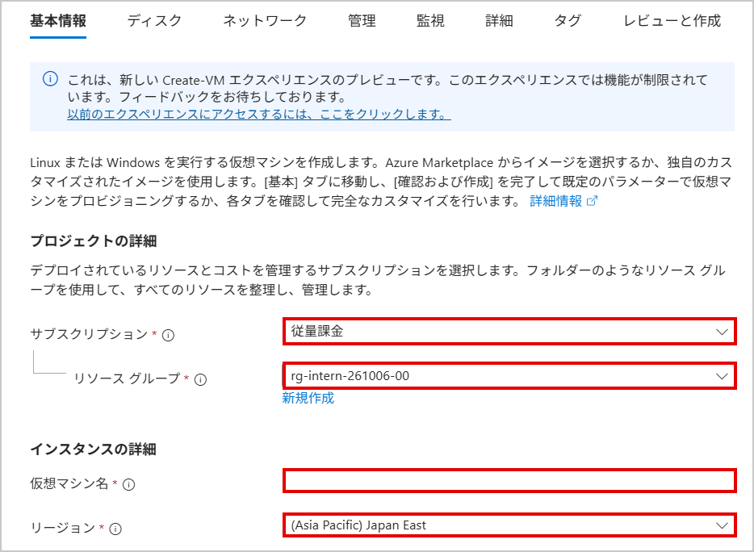

4. 「可用性オプション」で [インフラストラクチャ冗長は必要ありません] を選択します。

    > 注：既定は「可用性ゾーン」ですが、研修用の単発VMのため冗長構成は不要です。

5. 「セキュリティの種類」は [標準] を選択します。

    > 注：既定では [トラステッド起動の仮想マシン] が選択されています。必ず [標準] に変更してください。

6. 「Image」は [Ubuntu Server 24.04 LTS - x64 Gen2] のまま進めます。

7. 「VM architecture」は [x64] のまま進めます。

    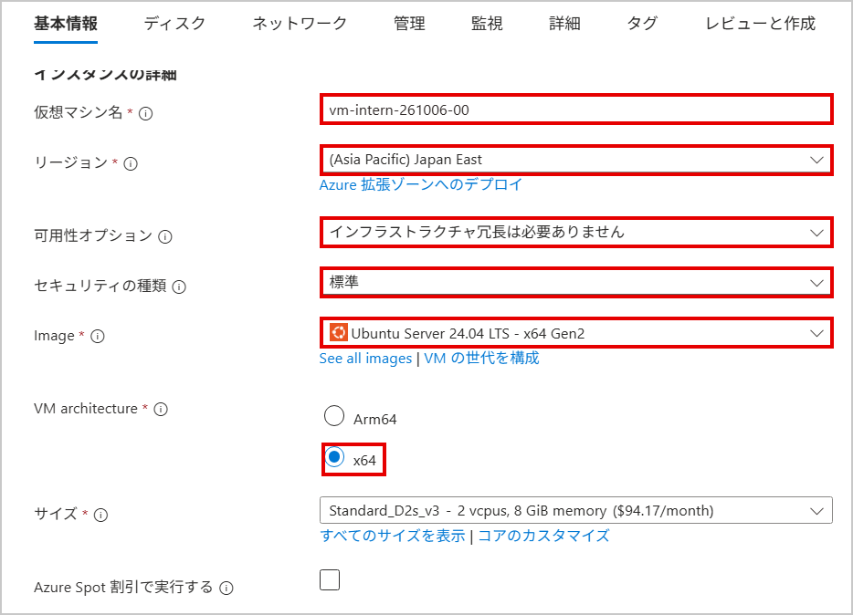

8. 「サイズ」の [すべてのサイズを表示] をクリックします。

9. 「VM サイズの選択」画面の検索欄に `b2ts` と入力し、一覧に表示された [B2ts_v2] を選択して [選択] をクリックします。

    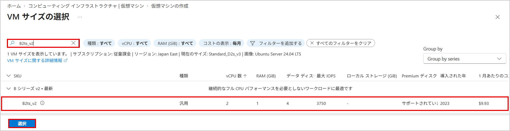

    | 項目 | 値 |
    |---|---|
    | SKU | B2ts_v2 |
    | vCPU 数 | 2 |
    | RAM (GiB) | 1 |

    > 注：既定の `Standard_D2s_v3` ではなく、必ず `B2ts_v2` を選択してください。

10. 「管理者アカウント」で、以下を設定します。

    | 項目 | 値 |
    |---|---|
    | 認証の種類 | パスワード |
    | ユーザー名 | azureuser |
    | パスワード | Pa55w.rd1234 |
    | パスワードの確認入力 | Pa55w.rd1234 |

    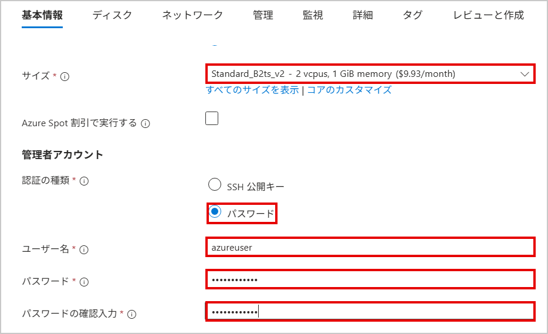

11. 「受信ポートの規則」で、以下を設定します。

    | 項目 | 値 |
    |---|---|
    | パブリック受信ポート | 選択したポートを許可する |
    | 受信ポートの選択 | SSH (22) |

    > 注：これによりすべての IP アドレスから SSH 接続が許可される旨の警告が表示されますが、研修用のため許容します。この設定は、Lab01 で NSG に追加した「AllowSSH」規則と重複する内容です。

    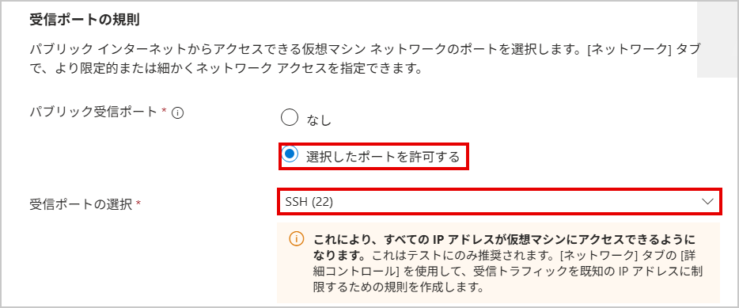

12. [次へ] をクリックし、[ディスク] タブに進みます。

13. 「OS ディスクの種類」で [Standard SSD] を選択します。

    | 項目 | 値 |
    |---|---|
    | OS ディスクの種類 | Standard SSD |
    | VM と共に削除 | チェックあり（既定のまま） |

    > 注：既定は「ローカル冗長ストレージ」の「Standard SSD」です。研修用のため、この既定値のままで問題ありません。

    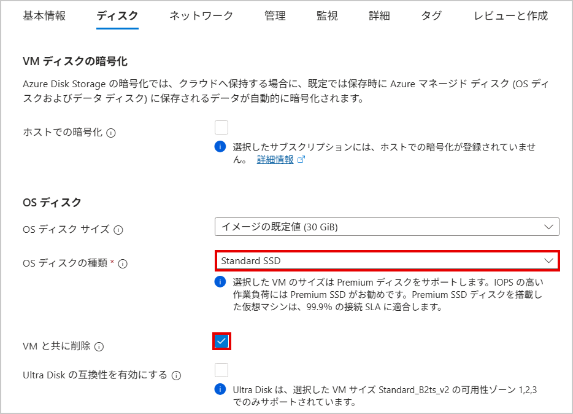

14. [次へ] をクリックし、[ネットワーク] タブに進みます。

15. 「Virtual network」で、一覧から [vnet-intern-YYMMDD-NN] を選択します。

16. 「Subnet」で、一覧から [default - 10.0.0.0/24] が選択されていることを確認します。

    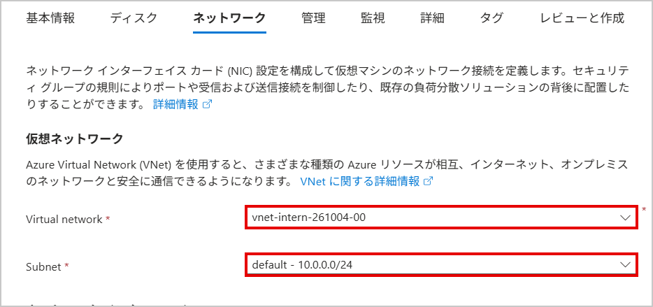

17. 「NIC ネットワーク セキュリティ グループ」で、[なし] を選択します。

    > 注：画面に「選択されたサブネット 'default - 10.0.0.0/24' は、既にネットワーク セキュリティ グループ 'nsg-intern-YYMMDD-NN' に関連付けられています。この仮想マシンへの接続の管理は、ここで新規のネットワーク セキュリティ グループを作成するのではなく、既存のネットワーク セキュリティ グループ経由で行うことをお勧めします。」と表示されます。案内どおり [なし] を選択してください。Lab01 で作成した NSG（受信規則：HTTP・SSH許可）がそのまま適用されます。

    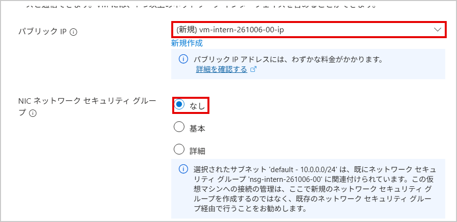

18. 「パブリック IP」は [(新規) vm-intern-YYMMDD-NN-ip] のまま進めます。

19. 画面を下にスクロールし、「負荷分散のオプション」が [なし] になっていることを確認します。

    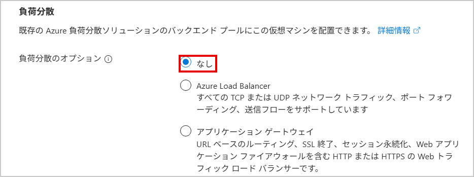

20. [次へ] をクリックし、[管理] タブに進みます。

21. [管理] タブは、すべて既定値（未選択）のまま進めます。

    | 項目 | 値 |
    |---|---|
    | システム割り当てマネージド ID の有効化 | チェックなし |
    | Microsoft Entra ID でログイン | チェックなし |
    | 自動シャットダウンを有効にする | チェックなし |
    | バックアップを有効にする | チェックなし |
    | 定期的な評価を有効にする | チェックなし |
    | 休止状態を有効にする | チェックなし |

    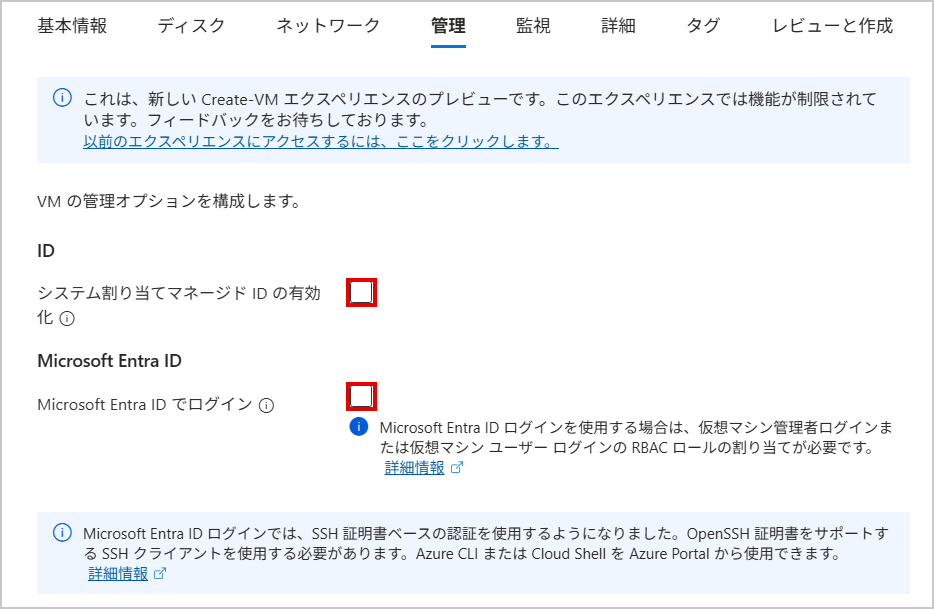

    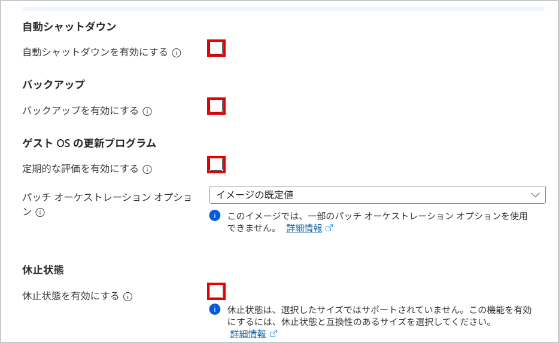

22. [次へ] をクリックし、[監視] タブに進みます。

23. [監視] タブも、既定値のまま進めます。

    | 項目 | 値 |
    |---|---|
    | 推奨されるアラート ルールを有効化 | チェックなし |
    | ブート診断 | マネージド ストレージ アカウントで有効にする（推奨） |
    | OS のゲスト診断を有効にする | チェックなし |
    | アプリケーションの正常性監視を有効にする | チェックなし |

    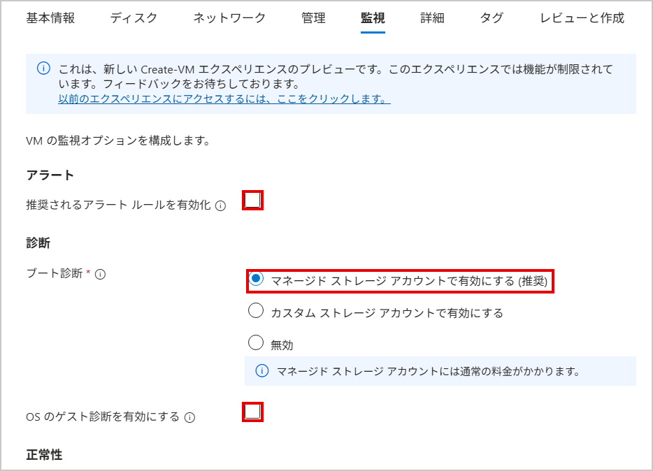

24. [次へ] をクリックし、[詳細] タブに進みます。何も設定せず、既定値のまま進めます。

25. [次へ] をクリックし、[タグ] タブに進みます。何も入力せず、そのまま [レビューと作成] タブに進みます。

26. [レビューと作成] タブで、以下の内容を確認します。

    | 項目 | 値 |
    |---|---|
    | サブスクリプション | 従量課金 |
    | リソース グループ | rg-intern-YYMMDD-NN |
    | 仮想マシン名 | vm-intern-YYMMDD-NN |
    | リージョン | Japan East |
    | 可用性オプション | インフラストラクチャ冗長は必要ありません |
    | セキュリティの種類 | Standard |
    | イメージ | Ubuntu Server 24.04 LTS |
    | サイズ | Standard B2ts_v2 |
    | 認証の種類 | パスワード |
    | ユーザー名 | azureuser |
    | パブリック受信ポート | SSH (22) |
    | 仮想ネットワーク | vnet-intern-YYMMDD-NN |
    | サブネット | default |
    | パブリック IP | (新規) vm-intern-YYMMDD-NN-ip |
    | NIC ネットワーク セキュリティ グループ | なし |

    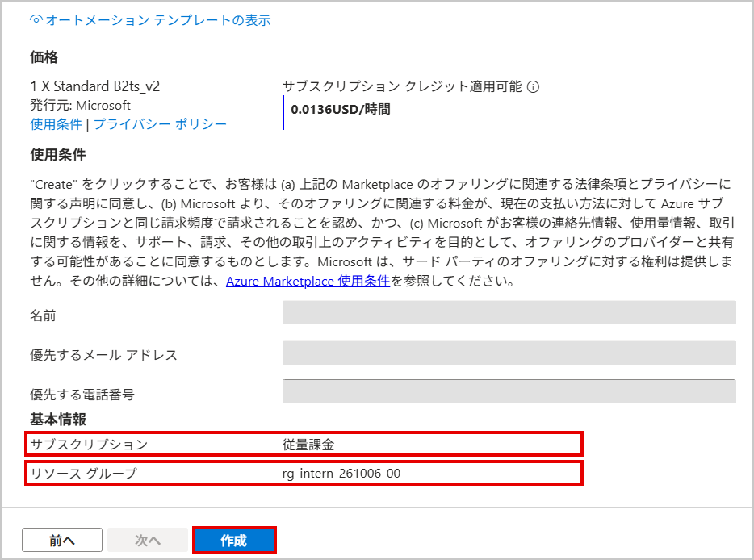

    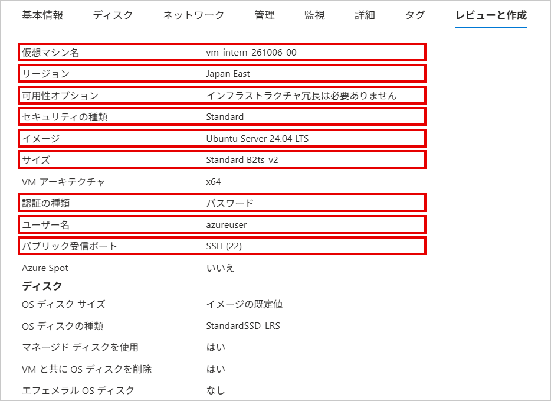

    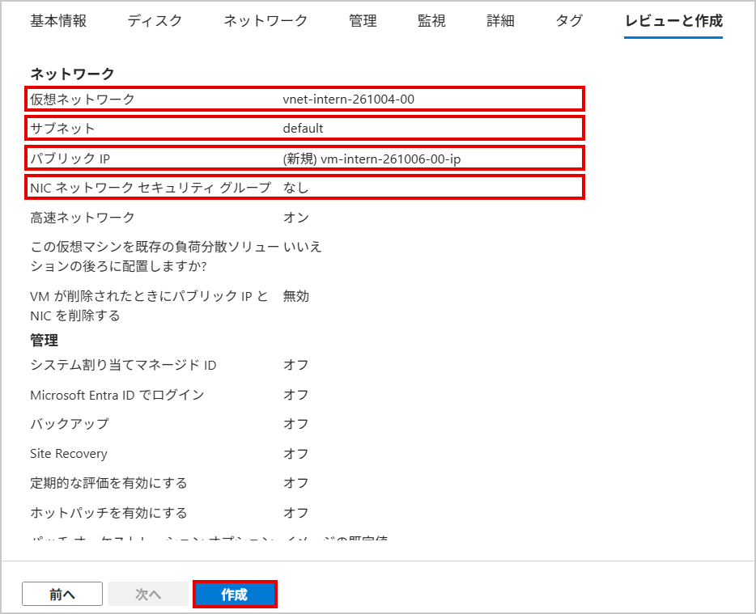

27. [作成] をクリックします。

28. 「デプロイが完了しました」と表示されるまで待ちます。

    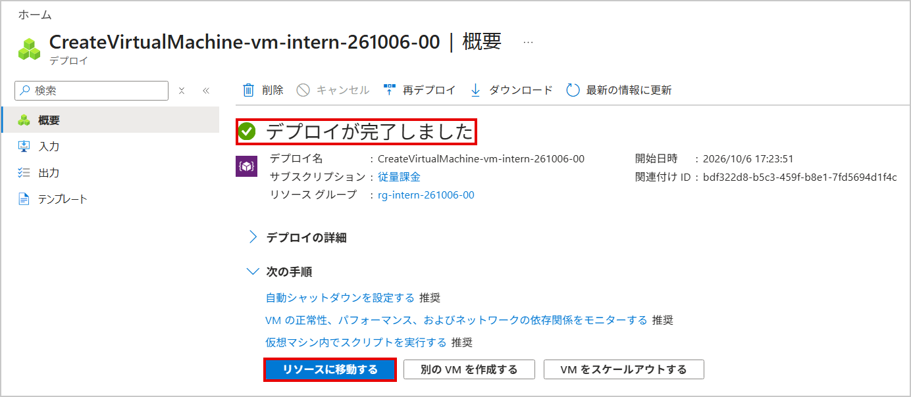

29. [リソースに移動する] をクリックし、「概要」画面で以下を確認します。

    | 項目 | 値 |
    |---|---|
    | 状態 | 実行しています |
    | サイズ | Standard B2ts v2 (2 vcpu 数、1 GiB メモリ) |
    | オペレーティング システム | Linux (ubuntu 24.04) |
    | プライマリ NIC パブリック IP | （表示されたIPアドレスを控えます） |
    | 仮想ネットワーク/サブネット | vnet-intern-YYMMDD-NN/default |

    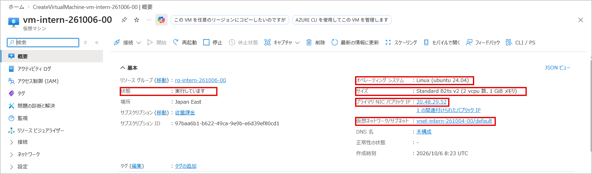

    > 注：以降の手順で使う「パブリックIPアドレス」をこの画面でメモしておいてください（例：20.48.57.15）。

## タスク 2 - パブリック IP アドレスを控える

1. VM「vm-intern-YYMMDD-NN」の「概要」画面で、「プライマリ NIC パブリック IP」の右にあるコピー アイコンをクリックし、IP アドレスをコピーします。

    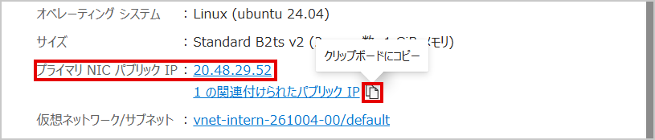

    > 注：この IP アドレスは、この後の SSH 接続で使用します。メモ帳などに貼り付けておくと、次の手順で使いやすくなります（例：20.48.57.15）。

## タスク 3 - PowerShell で SSH 接続する

1. Windows のタスクバー左下の検索アイコンをクリックし、`powershell` と入力します。

2. 検索結果から [Windows PowerShell] をクリックして起動します。

    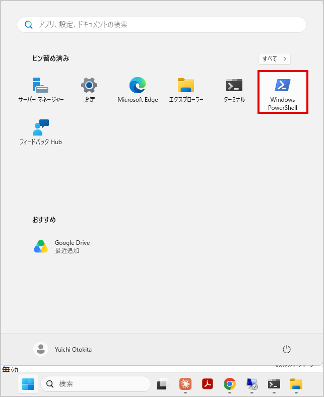

    > 注：Cloud Shell（Azure Portal 内蔵のシェル）ではなく、ローカル PC の Windows PowerShell を起動してください。

3. PowerShell の画面で、以下のコマンドを入力し、Enter キーを押します。IP アドレスは、タスク2で控えた VM のパブリック IP アドレスに置き換えてください。

    ```powershell
    ssh azureuser@<VMのパブリックIPアドレス>
    ```

    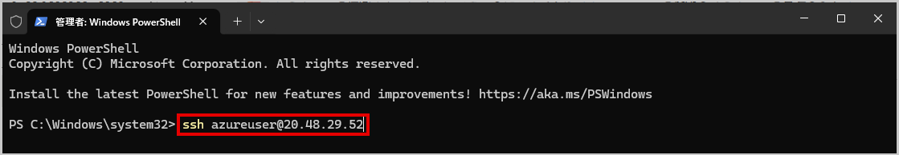

4. 初回接続時、以下のメッセージが表示されます。`yes` と入力し、Enter キーを押します。

    ```
    The authenticity of host '<IPアドレス> (<IPアドレス>)' can't be established.
    ED25519 key fingerprint is SHA256:xxxxxxxxxxxxxxxxxxxxxxxxxxxxxxxxxxxxxxxxxxx.
    This key is not known by any other names.
    Are you sure you want to continue connecting (yes/no/[fingerprint])?
    ```

    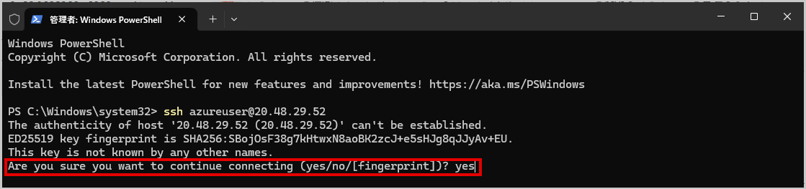

    > 注：これは接続先サーバーの信頼性を確認するメッセージです。「yes」と入力しないと接続できません。

5. `Warning: Permanently added '<IPアドレス>' (ED25519) to the list of known hosts.` と表示された後、パスワードの入力を求められます。`Pa55w.rd1234` を入力し、Enter キーを押します。

    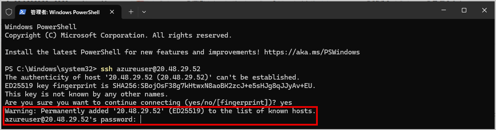

    > 注：入力中、画面には何も表示されません（アスタリスクも出ません）。正しく入力できていますので、そのまま Enter を押してください。

6. `azureuser@vm-intern-YYMMDD-NN:~$` のようなプロンプトが表示されれば、接続成功です。

    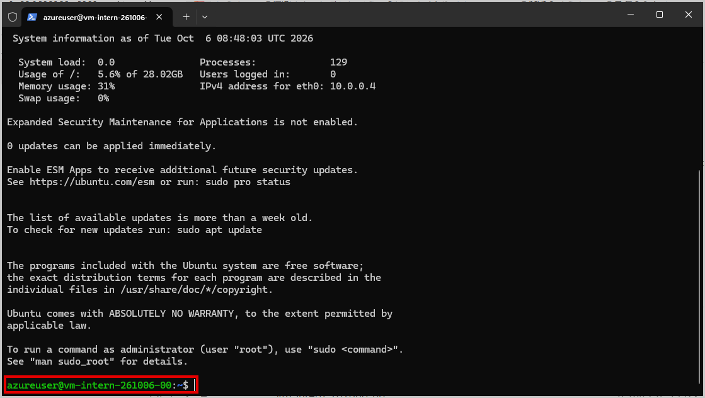

これでLab02（タスク1〜3：VM作成・パブリックIP確認・PowerShellでのSSH接続）は完成です。
