## 推定時間：40分

Lab03 で配置したサンプルチャットサイトは、まだ AI と会話できません。
このLabでは、Azure AI Foundry を作成してモデルをデプロイし、`config.js` に接続情報を書き込むことで、実際に AI と会話できる状態にします。

## タスク 1 - Azure AI Foundry リソースを作成する

1. Azure Portal 上部の検索バーに `AI Foundry` と入力し、検索候補の「サービス」欄から [Microsoft Foundry] を選択します。

    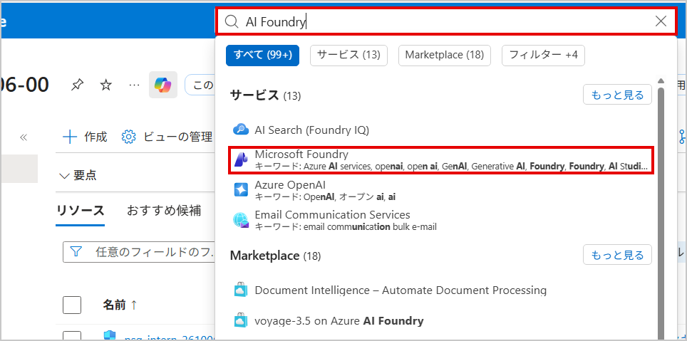

2. 「Microsoft Foundry」の概要画面が表示されたら、[リソースの作成] をクリックします。

    > 注：すでに他のリソースが作成済みの一覧画面が表示された場合は、画面左上の [＋ 作成] をクリックし、表示されるメニューから [新しい Microsoft Foundry の作成] を選択してください。

    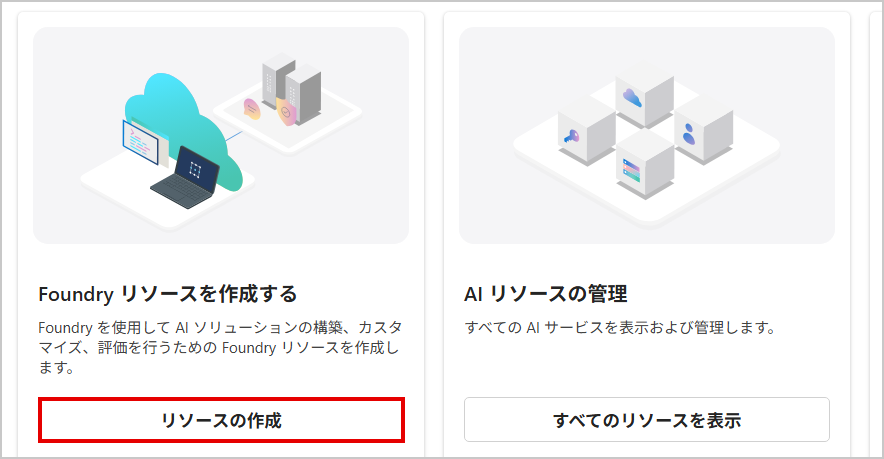

3. 「Foundry リソースを作成する」画面の [基本情報] タブで、以下を設定します。

    | 項目 | 値 |
    |---|---|
    | サブスクリプション | 従量課金 |
    | リソース グループ | rg-intern-YYMMDD-NN |
    | 名前 | aif-intern-YYMMDD-NN |
    | リージョン | (Asia Pacific) Japan East |

    > 注：「リソース グループ」を選択すると、「名前」欄に既定でリソース グループ名（`rg-intern-YYMMDD-NN`）がそのままコピーされます。これは自動入力であり、そのまま進めると他のリソース（VNet や VM）と紛らわしい名前になってしまいます。**必ず `aif-intern-YYMMDD-NN` に書き換えてください。**

    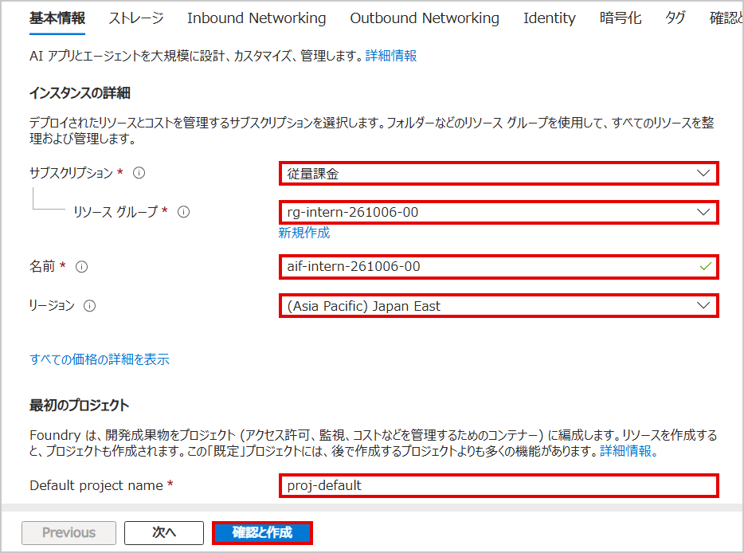

4. 「Default project name」は既定値（`proj-default`）のまま変更しません。

5. 「コンテンツ レビュー ポリシー」も既定のまま変更しません。

6. 画面左下の [確認と作成] をクリックします。

7. 内容を確認し、[作成] をクリックします。

    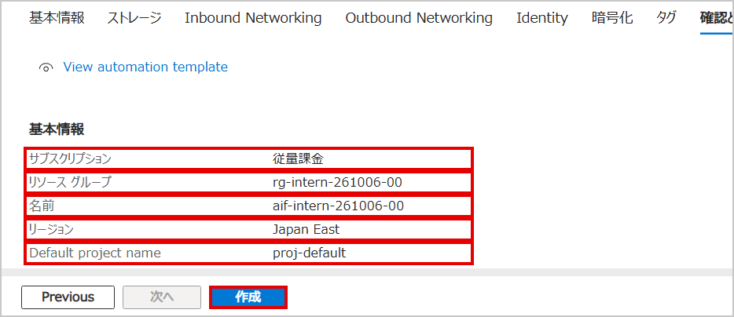

8. 「デプロイが完了しました」と表示されるまで待ちます（数分かかります）。

    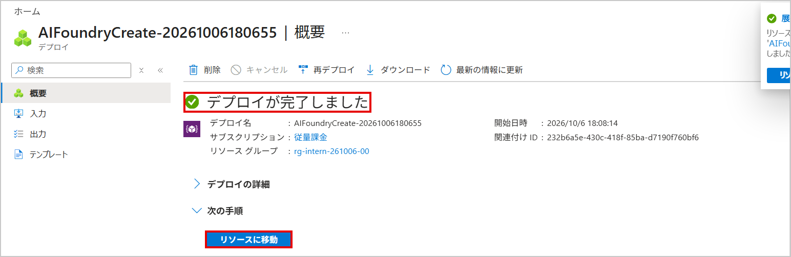

9. [リソースに移動] をクリックし、「概要」画面が表示されることを確認します。

    | 項目 | 値 |
    |---|---|
    | API の種類 | AIServices |
    | 場所 | japaneast |
    | 状態 | Succeeded |

    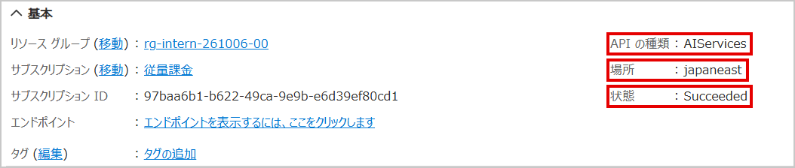

## タスク 2 - モデルをデプロイする

1. リソースの「概要」画面で、[Foundry ポータルに移動] をクリックします。

    > 注：別タブで Foundry ポータル（`ai.azure.com`）が開きます。Azure Portal のタブは、この後の手順で使うのでそのまま残しておいてください。

    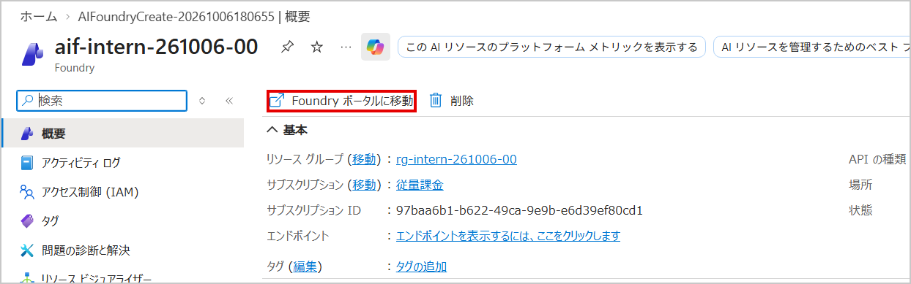

2. Foundry ポータルの「ようこそ、〇〇さん」画面で、「モデルを使用する」カードの [デプロイの表示] をクリックします。

    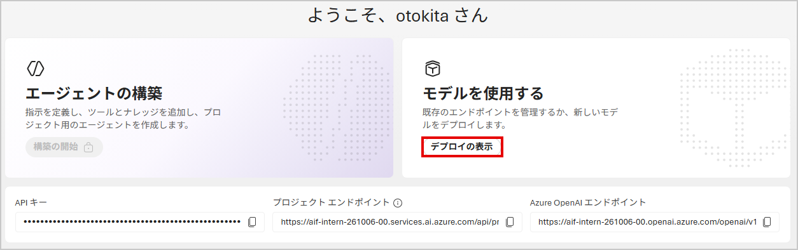

3. 「デプロイ」画面で、画面右上の [＋ モデルのデプロイ] をクリックし、[基本モデルをデプロイする] をクリックします。

    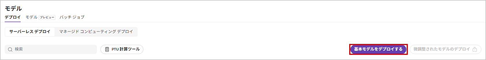

4. 「モデル」一覧の検索欄に `gpt-5.4-nano` と入力します。

    > 注：モデル名は「ドット区切り」です（`gpt-5-4-nano` ではなく `gpt-5.4-nano`）。**本研修では必ず `gpt-5.4-nano` を使用してください。** 似た名前の `gpt-5.4-mini` は容量が不足しており、デプロイに失敗します。

    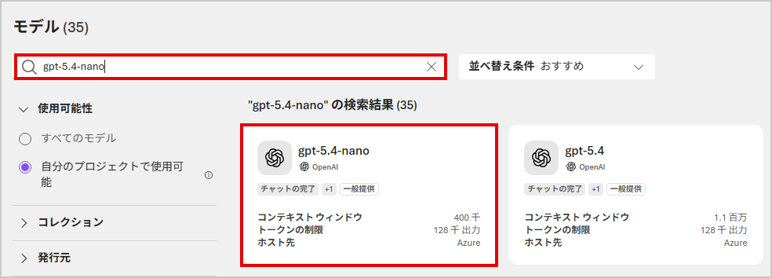

5. 検索結果から [gpt-5.4-nano] のカードを選択します。

6. モデルの詳細画面が表示されたら、右上の [デプロイ] をクリックし、表示されるメニューから [既定の設定] を選択します。

    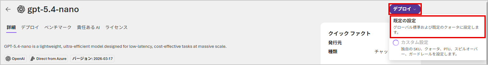

7. 「gpt-5.4-nano のデプロイ」パネルが表示されます。以下の内容を確認します（変更不要です）。

    | 項目 | 値 |
    |---|---|
    | デプロイ名 | gpt-5.4-nano |
    | デプロイの種類 | グローバル標準 |

    > 注：デプロイ名は必ず既定値の `gpt-5.4-nano` のまま進めてください。この後 `config.js` の設定値と一致させる必要があります。

    

8. パネル下部の [デプロイ] をクリックします。

9. デプロイが完了すると、自動的に「プレイグラウンド」画面に切り替わります。「モデル: gpt-5.4-nano」と表示されていることを確認します。

    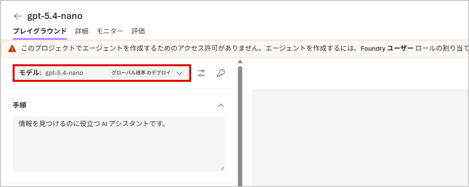

10. （任意）画面右側のチャット欄に「こんにちは」と入力して送信し、AI から応答が返ることを確認します。

    > 注：ここで確認できるのは Foundry ポータル上での動作です。自分のチャットサイトから使うには、この後の手順でエンドポイントと API キーを取得する必要があります。

    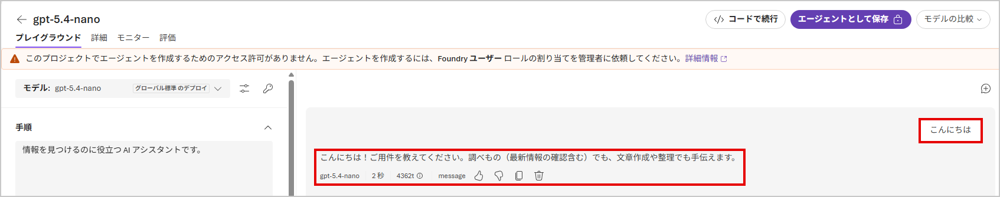

## タスク 3 - エンドポイントと API キーを取得する

このタスクでは、2 つの異なる画面から、それぞれ別の情報を取得します。

1. Foundry ポータル左上の「Microsoft Foundry」をクリックし、ホーム画面（「ようこそ、〇〇さん」の画面）に戻ります。

2. 「Azure OpenAI エンドポイント」欄の コピー アイコンをクリックし、値をコピーします。

    > 注：似た項目に「プロジェクト エンドポイント」がありますが、こちらは使用しません。**必ず「Azure OpenAI エンドポイント」の値を使ってください。** コピーした値は `https://aif-intern-YYMMDD-NN.openai.azure.com/openai/v1` のような形式で、末尾に `/openai/v1` が付いています。この部分は後の手順で取り除きます。

    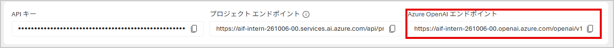

3. Azure Portal 側のタブに切り替えます（タスク2の手順1で開いたままにしていたタブです）。リソースの「概要」画面で、左側メニューの [リソース管理] を展開し、[キーとエンドポイント] をクリックします。

    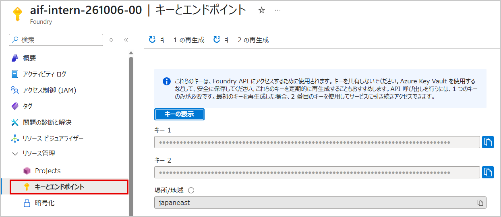

4. 「キー 1」の値を、コピー アイコンでコピーします。

    > 注：**ここで取得する「キー 1」が、チャットサイトで使う正しい API キーです。** Foundry ポータルのホーム画面にも「API キー」という項目がありますが、これは別の用途（プロジェクト単位）のキーであり、チャットサイトからの接続には使用できません。誤って使うと「API キーが正しくありません」（401 エラー）が発生します。

    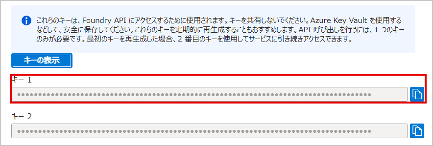

## タスク 4 - config.js を書き換えて動作確認する

1. Lab02 で接続した PowerShell の SSH セッションで、以下のコマンドを実行し、コピーしたエンドポイントの末尾から `/openai/v1` を取り除いた値を変数に入れます。

    ```bash
    read -r RAW_ENDPOINT
    ```

    Enter キーを押すとカーソルだけの行になるので、タスク3でコピーした「Azure OpenAI エンドポイント」の値を貼り付けて、再度 Enter キーを押します。

2. 続けて、以下のコマンドを実行し、末尾を取り除いた値を確認します。

    ```bash
    ENDPOINT="${RAW_ENDPOINT%/openai/v1}"
    echo "$ENDPOINT"
    ```

    表示された値が、末尾に余分な文字が付いていない `https://aif-intern-YYMMDD-NN.openai.azure.com` の形式になっていることを確認してください。

    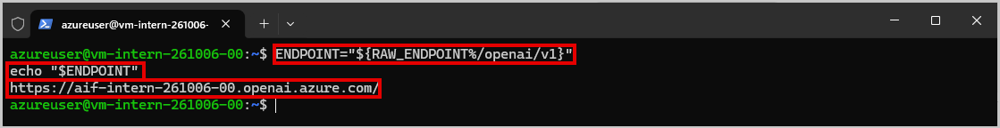

3. `config.js` の `ENDPOINT` を書き換えます。

    ```bash
    sudo sed -i "s|<<エンドポイントを貼り付け>>|$ENDPOINT|" /var/www/html/config.js
    ```

4. API キーを変数に入れます。

    ```bash
    read -r API_KEY
    ```

    Enter キーを押した後、タスク3でコピーした「キー 1」の値を貼り付けて、再度 Enter キーを押します。

5. `config.js` の `API_KEY` を書き換えます。

    ```bash
    sudo sed -i "s|<<APIキーを貼り付け>>|$API_KEY|" /var/www/html/config.js
    ```

6. 書き換えた内容を確認します。

    ```bash
    grep -E "ENDPOINT|DEPLOYMENT|API_KEY" /var/www/html/config.js
    ```

    以下の3項目が表示されることを確認します。

    | 項目 | 値の例 |
    |---|---|
    | ENDPOINT | `https://aif-intern-YYMMDD-NN.openai.azure.com` |
    | DEPLOYMENT | `gpt-5.4-nano`（既定値のまま） |
    | API_KEY | （タスク3でコピーした文字列） |

    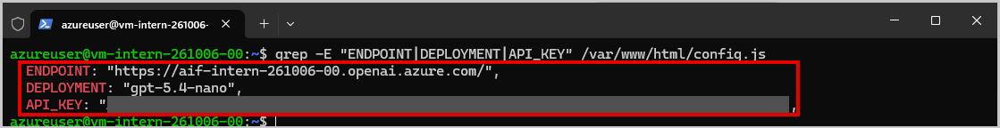

7. Web ブラウザで `http://<VMのパブリックIPアドレス>/` を開き、`Ctrl + F5`（スーパーリロード）で画面を更新します。

8. 画面上部の赤い案内が消え、「こんにちは。聞きたいことを入力してください。」という AI からの最初のメッセージが表示されることを確認します。

    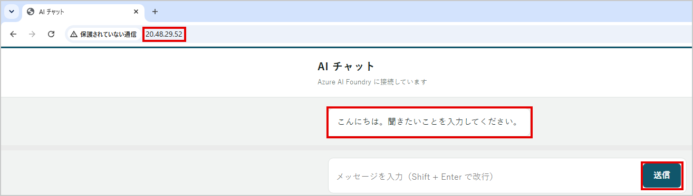

9. メッセージ入力欄に何か質問を入力し、送信します。AI から応答が返ってくれば、接続は成功です。

    > 注：応答に数秒かかることがあります。応答中は入力欄と送信ボタンが一時的に無効になります。

    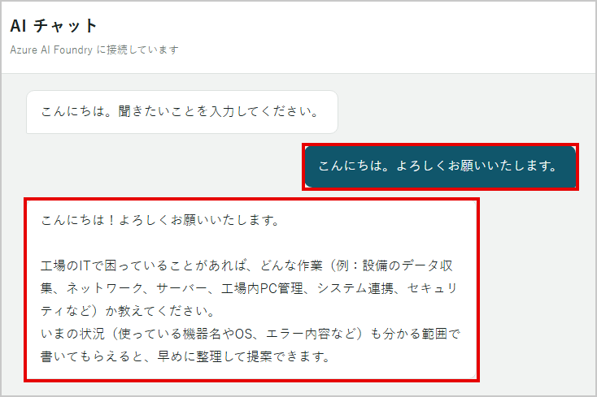

これで Lab04（タスク1〜4：AI Foundry リソースの作成、モデルのデプロイ、エンドポイント・API キーの取得、config.js の書き換えと動作確認）は完成です。

## うまく動かないとき

| 症状 | 確認すること |
|---|---|
| 「API キーが正しくありません」（401） | `API_KEY` に Foundry ポータルのホーム画面の「API キー」を使っていないか。Azure Portal の「キーとエンドポイント」画面の「キー 1」を使っているか確認してください |
| 「接続先が見つかりません」（404） | `ENDPOINT` の末尾に `/openai/v1` が残っていないか、`.openai.azure.com` の前のリソース名が正しいか |
| 「クォータが不足しています」と表示されデプロイできない | 検索したモデル名が `gpt-5.4-nano`（ドット区切り）になっているか。`gpt-5-4-mini` や `gpt-5.4-mini` は選択しないでください |
| 画面が真っ白、または反応しない | `config.js` の記述にカンマの消し忘れなどがないか。`sudo cat /var/www/html/config.js` で内容を確認してください |

その他のエラーメッセージについては、[`sampleChatbotSite/README.md`](../sampleChatbotSite/README.md) のトラブルシュート表もあわせて確認してください。
