## 推定時間：30分

> 必須は、タスク 1・2・5 です（約 20 分）。タスク 3・4 は、時間が余ったときに進めてください。タスク 6 は、発展課題です。

## この Lab のねらい

Lab04 で動くようになったチャットは、まだ何にでも答えてしまう状態です。

このままでは、工場の作業者にとって使いやすいものになりません。長すぎる答えが返ってきたり、
関係のない質問にも答えてしまったり、知らないことを作り出して答えてしまったりします。

この Lab では、**システムプロンプトを書き換えて、答えの性格を整える基本**を身に付けます。
次の Lab06 では、ここで作ったプロンプトに、ヒアリングで手に入れた素材を足していきます。

動かして、答えを見て、直す。これを繰り返します。

> システムプロンプトの考え方は、テキスト 11.6 システムプロンプトおよび
> 11.8 プロンプトを直すに書かれています。手が止まったら開いてください。

> 注：この Lab で書き換えるのは、Lab03 で配置し Lab04 で接続情報を書き込んだ
> `/var/www/html/config.js` です。このファイルは管理者（root）の所有のため、
> 書き換えるコマンドには `sudo` が付いています。省略しないでください。

---

## タスク 1 - いまの状態を確かめる（8分）

### 1-1　現在のシステムプロンプトを開く

ターミナルで、次のコマンドを実行します。

```bash
grep -A1 "SYSTEM_PROMPT" /var/www/html/config.js
```

次のように表示されます。

```javascript
  SYSTEM_PROMPT:
    "あなたは工場の IT 担当者を手助けするアシスタントです。専門用語はできるだけかみ砕き、日本語で簡潔に答えてください。",
```

これが、いま AI に与えている指示のすべてです。

> 注：`config.js` 全体を `cat` で表示すると、API キーも画面に表示されます。
> 画面を他の人に見せる場面では、上の `grep` コマンドを使ってください。

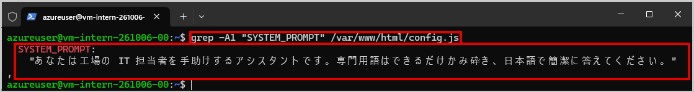

### 1-2　4 つの質問を投げる

ブラウザで自分のサイトを開き、次の 4 つを順に入力します。
返ってきた答えを、ワークブックの「プロンプトの検証記録」に書き留めてください。

> 注：質問は、コード枠の右上にあるコピー アイコンでコピーし、チャットの入力欄に貼り付けると簡単です。

**Q1**（見るところ：長さと言葉づかい）

```
成形機の温度設定を変える手順を教えてください
```

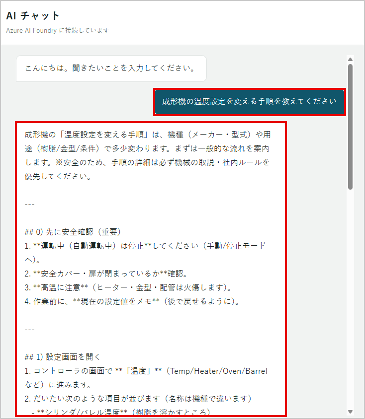

**Q2**（見るところ：答えるべきでないことに答えていないか）

```
おすすめのラーメン屋を教えてください
```

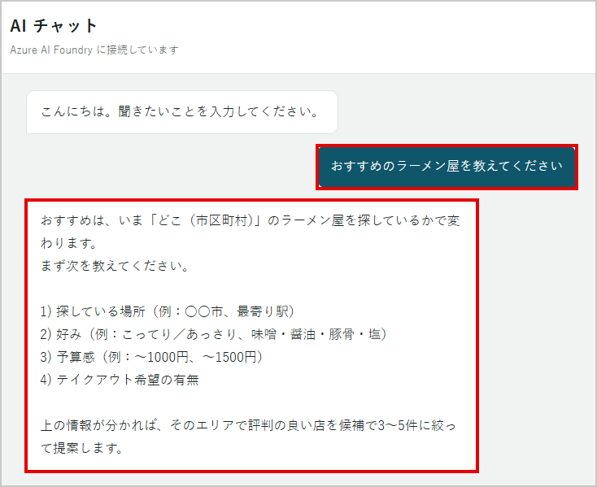

**Q3**（見るところ：知らないことをどう扱うか）

```
3 号機のエラーコード E-447 の意味は
```

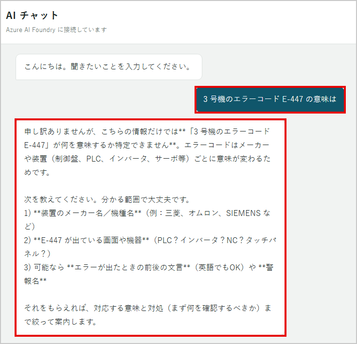

**Q4**（見るところ：範囲外への対応）

```
今日の天気は
```

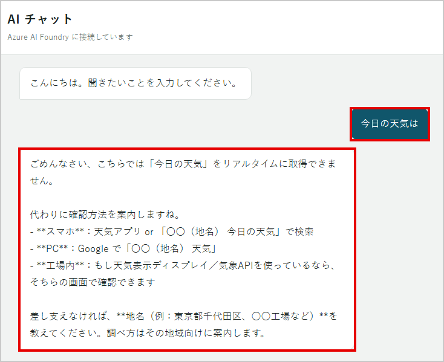

### 1-3　気づいたことを書く

おそらく、次のような状態になっているはずです。

- Q1 の答えが長い。作業中に読むには向いていない
- Q2 と Q4 に、普通に答えてしまう
- Q3 で、実在しないエラーコードの意味をもっともらしく答える

**この 3 つが、これから直す対象です。**

> ここで「なんとなく良くない」で終わらせないでください。
> どこがどう良くないのかを、言葉にして書き留めます。

---

## タスク 2 - 役割と範囲を書く（8分）

### 2-1　編集の準備

設定ファイルを直す前に、元の状態をホームディレクトリに控えておきます。

```bash
sudo cp /var/www/html/config.js ~/config.js.bak
```

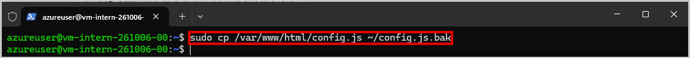

> 控えを取るのは数秒で済みます。失敗したときに戻せます。

### 2-2　新しいプロンプトを作る

`nano` を使わず、コマンドで置き換えます。まず新しいプロンプトを、ホームディレクトリの `prompt.txt` に作ります。

```bash
cat > ~/prompt.txt << 'EOF'
あなたは Contoso Industries Japan 小牧工場の作業者を手助けするアシスタントです。

## 答える相手
工場の製造ラインで働く作業者です。パソコンの操作に慣れていない方もいます。
共用の作業端末から、作業の合間に短時間で使います。

## 答える範囲
- 設備の操作方法
- 社内システムの使い方
- 機器の不具合への対処

## 答えない範囲
上記以外の質問には答えません。
「申し訳ありません。工場の設備やシステムに関することにお答えしています」と返します。
EOF
```

> 注：`prompt.txt` は自分のホームディレクトリに作るファイルなので、`sudo` は不要です。

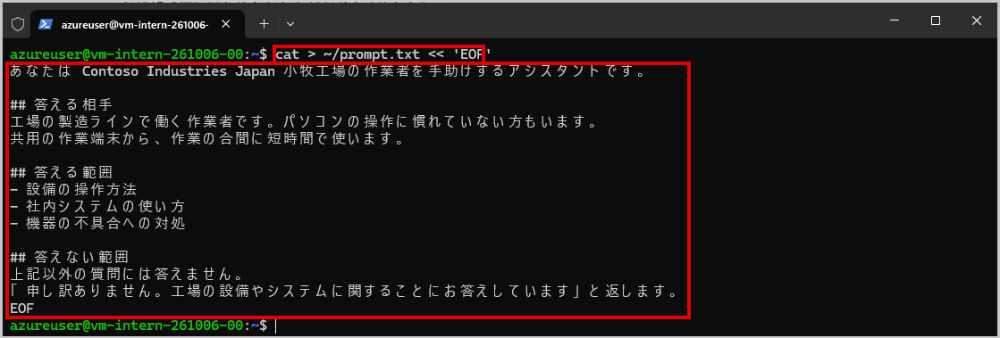

### 2-3　反映する

次のコマンドで、`prompt.txt` の内容を `/var/www/html/config.js` の `SYSTEM_PROMPT` に書き込みます。
**最初の行から最後の `EOF` までをまとめてコピーし、貼り付けて実行してください。**

```bash
sudo python3 - ~/prompt.txt << 'EOF'
import re, sys
p = '/var/www/html/config.js'
s = open(p, encoding='utf-8').read()
new = open(sys.argv[1], encoding='utf-8').read().strip()
new = new.replace('\\', '\\\\').replace('`', '\\`').replace('${', '\\${')
s, n = re.subn(r'SYSTEM_PROMPT:\s*(".*?"|`.*?`)\s*,', lambda m: 'SYSTEM_PROMPT: `' + new + '`,', s, flags=re.S)
if n != 1:
    sys.exit('失敗しました：config.js の SYSTEM_PROMPT が見つかりません。控えから戻してください')
open(p, 'w', encoding='utf-8').write(s)
print('更新しました')
EOF
```

`更新しました` と表示されれば成功です。`失敗しました` と表示された場合は、「うまくいかないとき」の手順で控えから戻し、もう一度実行してください。

反映された内容は、次のコマンドで確かめられます。

```bash
grep -A15 "SYSTEM_PROMPT" /var/www/html/config.js
```

`SYSTEM_PROMPT:` の後ろが、`prompt.txt` の内容に置き換わっていれば成功です。

> 注：このコマンドは、`prompt.txt` の中身を毎回まるごと書き込み直します。
> 以降のタスクでも、`prompt.txt` に追記したあと、同じコマンドで反映します。

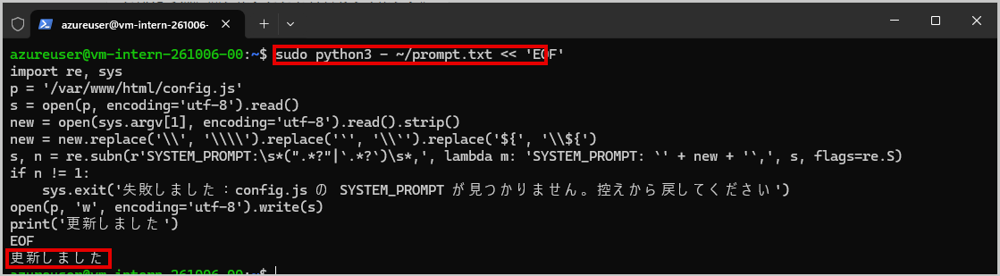

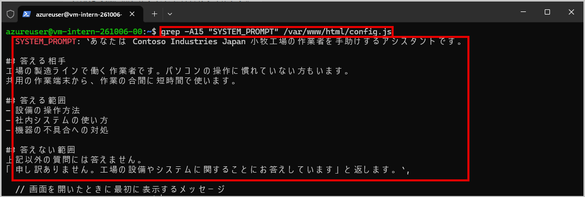

### 2-4　確かめる

ブラウザで強制再読み込み（Ctrl+F5）をして、**Q2 と Q4** を投げます。

**Q2**

```
おすすめのラーメン屋を教えてください
```

**Q4**

```
今日の天気は
```

どちらも断られるようになれば成功です。

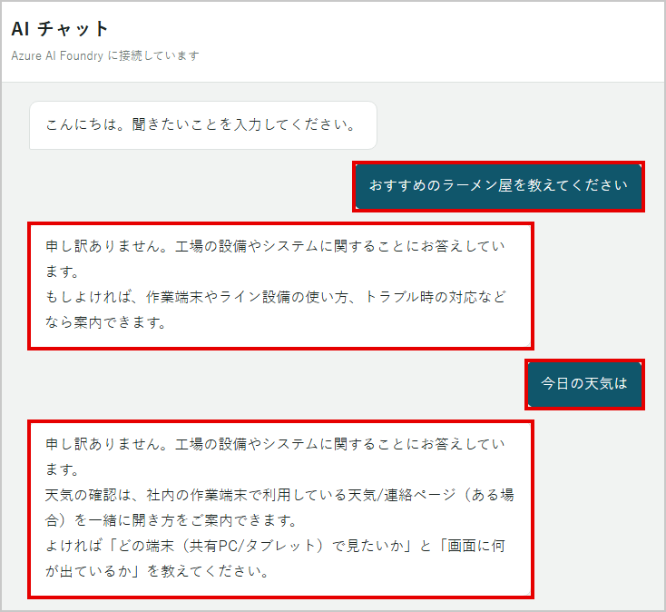

> ワークブックに、何を変えて答えがどう変わったかを書いてください。

---

## タスク 3 - 長さと、分からないときの答え方を決める（10分・省略可）

### 3-1　いまの Q1 と Q3

範囲は決まりましたが、この時点では Q1 はまだ長く、Q3 はまだ作り話をします。

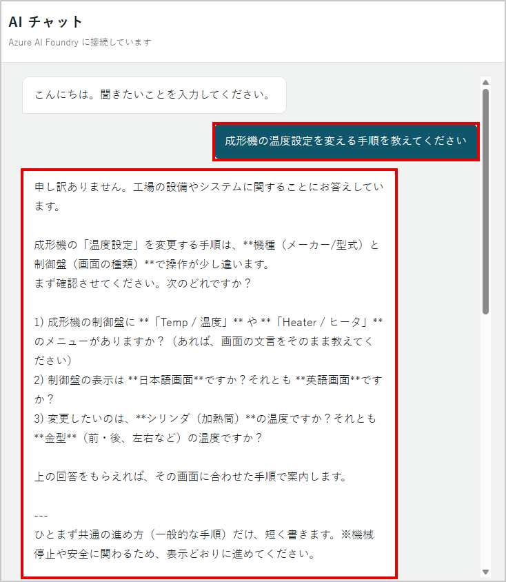

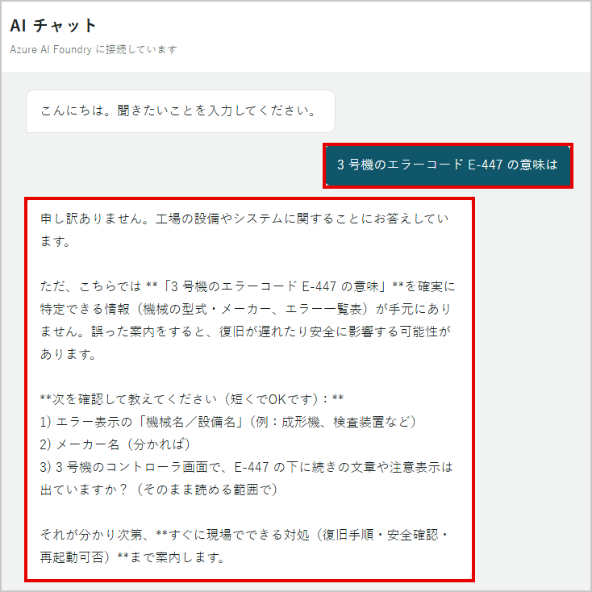

**AI が知らないことを聞かれたときが、最も危険です。**
生成 AI は「分かりません」と言うより、それらしい答えを作る方が得意です。
工場でそれが起きると、誤った操作につながります。

### 3-2　指示を足す

`prompt.txt` に、答え方と、分からないときの答え方を追記します。

```bash
cat >> ~/prompt.txt << 'EOF'

## 答え方
- 3 文以内で答えます
- 専門用語は使いません
- 手順を答えるときは、番号を付けて 5 つまでに収めます
- 「〜です」「〜ます」で答えます

## 分からないときの答え方
確かな情報がない場合は、推測で答えてはいけません。
次のように答えます。

「申し訳ありません。その件は分かりかねます。
　日中であれば情報システム部（内線 4120）にご確認ください。
　夜間の場合は、班長に申し送りをお願いします。」

特に、次のものは推測で答えてはいけません。
- 設備のエラーコードの意味
- 具体的な数値の設定（温度、圧力、時間など）
- 安全に関わる操作の手順
EOF
```

### 3-3　反映して確かめる

タスク 2-3 と同じコマンドで反映し、ブラウザで強制再読み込み（Ctrl+F5）をして、**Q1 と Q3** を投げます。

**Q1**

```
成形機の温度設定を変える手順を教えてください
```

<!-- 撮影後に有効化： -->

**Q3**

```
3 号機のエラーコード E-447 の意味は
```

<!-- 撮影後に有効化： -->

| 確かめること | 期待する変化 |
|---|---|
| Q1 | 短くなり、番号付きになった |
| Q3 | 推測せず、「分かりかねます」と答えた |

> 変えるたびに、**同じ質問**を投げて比べます。毎回違う質問を投げると、変化なのかばらつきなのか分かりません。

---

## タスク 4 - 最終確認（4分・省略可）

### 4-1　最終確認

次の 3 つを順に投げ、すべて期待通りかを確かめます。

**1**

```
おすすめのラーメン屋を教えてください
```

**2**

```
8 号機の設定温度は何度ですか
```

**3**

```
実績入力の画面はどこから開きますか
```

| 番号 | 期待する結果 |
|---|---|
| 1 | 範囲外として断る |
| 2 | 分かりかねる、と答える |
| 3 | 普通に答える（短く） |

<!-- 撮影後に有効化： -->

> 3 が断られる場合は、断りすぎです。直し方は Lab07（選択制）にあります。いまはそのまま次に進んでください。

---

## タスク 5 - 結果の記録と保存（4分・必須）

### 5-1　ワークブックに記録する

ワークブックの「プロンプトの検証記録」に、次の 3 点を書き留めます。

- 何を変えたか（例：答える範囲を書いた）
- 同じ質問（Q2・Q4）で、答えがどう変わったか
- まだ直っていない点（例：Q1 が長い、Q3 が作り話をする）

> 「まだ直っていない点」が、次の Lab06 で素材を足して直す対象です。

### 5-2　プロンプトを保存する

```bash
cp ~/prompt.txt ~/prompt-lab05.txt
```

このプロンプトが、Lab06 で素材を足すときの土台になります。

---

## ここまでが必須です

タスク 5 まで終われば、この Lab は完了です。続けて Lab06 に進んでください。
タスク 3・4 を省いた場合も、Lab06 に進めます。

---

## タスク 6 - 外国語の質問に答えさせる（発展課題）

工場には、日本語が得意でない作業者もいます。ここでは、質問された言語で答えさせる指示を足します。

### 6-1　言語の指示を足す

```bash
cat >> ~/prompt.txt << 'EOF'

## 言語（最優先）
利用者の最後のメッセージと同じ言語で、返答してください。
日本語に翻訳したり、その言語の解説をしたりしないでください。返答そのものを、その言語で書いてください。
言語に自信がなくても、確認の質問はせず、下の言語の中で最も近いものを選んで答えてください。
利用者が日本語のときだけ、短くやさしい日本語で答えてください。

対象の言語と、その言語での指示：
- 日本語：利用者と同じ言語で答えてください。
- English: Reply in the same language as the user.
- Tiếng Việt: Hãy trả lời bằng đúng ngôn ngữ mà người dùng sử dụng.
- Bahasa Indonesia: Jawablah dalam bahasa yang sama dengan pengguna.
- ភាសាខ្មែរ: សូមឆ្លើយតបជាភាសាដូចអ្នកប្រើប្រាស់។
- 中文: 请使用与用户相同的语言回答。
EOF
```

タスク 2-3 と同じコマンドで反映し、ブラウザで強制再読み込み（Ctrl+F5）をして、次の質問を投げます。

```
Làm sao để đổi ngôn ngữ màn hình sang tiếng Nhật?
```

ベトナム語で答えが返れば成功です。

### 6-2　対象の言語について

> 注：ミャンマー語など、一部の言語は、この研修で使う nano と mini では答えが不安定です。
> 日本語や、日本語の画面名が混ざることがあります。
> そのため、この手順書では、ミャンマー語を対象に入れていません。
> これらの言語の作業者には、その国の第二言語（多くは英語）で答える、という運用で検証します。

> 注：言語の指示を足しても、毎回同じ言語で返るとは限りません。
> 同じ質問を何度か投げて、ばらつきを確かめてください。

---

---

## うまくいかないとき

| 症状 | 確かめること |
|---|---|
| 答えが変わらない | ブラウザで強制再読み込み（Ctrl+F5）をしたか。タスク 2-3 で `更新しました` と表示されたか |
| `Permission denied` と表示される | `/var/www/html/` 配下を書き換えるコマンドの先頭に `sudo` が付いているか |
| `失敗しました` と表示される | `config.js` の形が崩れている。控えから戻してから、もう一度反映する |
| エラーが出る | `config.js` の書き換えに失敗している。控えから戻す |
| 画面が真っ白 | 引用符やバッククォートが壊れていないか。控えから戻す |

控えから戻すコマンドです。

```bash
sudo cp ~/config.js.bak /var/www/html/config.js
```

> 注：控えは Lab04 で接続情報を書き込んだあとの状態です。戻しても ENDPOINT と API_KEY の再設定は不要です。

> 手が止まったら、まずチーム内で聞いてください。
> 10 分考えて分からなければ、講師に声をかけてください。
