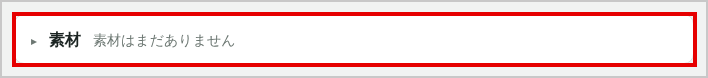
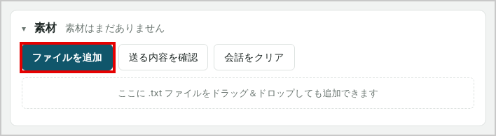
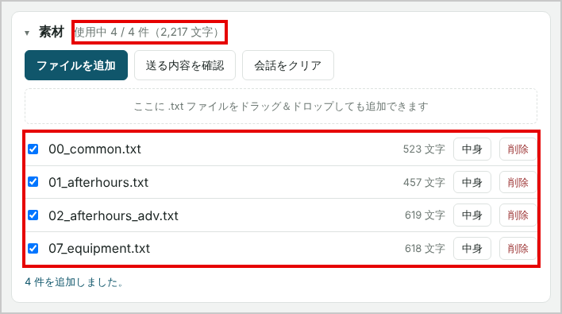
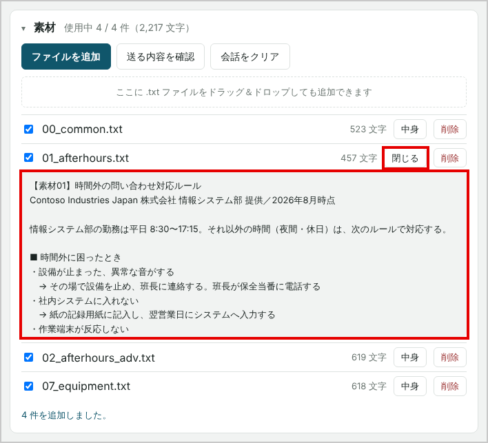
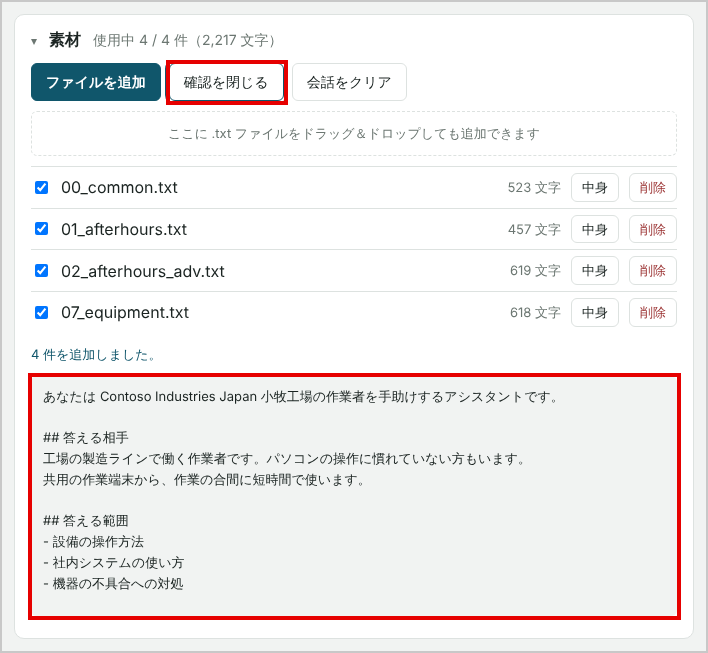
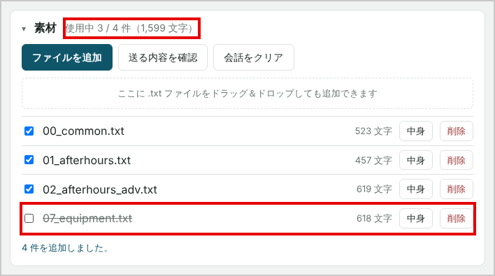

## 推定時間：30分

## この Lab のねらい

Lab05 のチャットボットは、答え方は整いましたが、**会社のことを何も知りません。**
「夜中に端末が動かないときはどうするか」と聞かれても、一般論で答えるか、「分かりかねます」と答えるだけです。

Day1 のヒアリングで、皆さんは藤井さんから**素材ファイル（.txt）**を受け取りました。
素材には、工場の手順やルール、作業者が困っていることが書かれています。

この Lab では、**手に入れた素材をチャットボットに読ませて、自分たちのチャットボットにします。**

どの素材を手に入れたかは、チームによって違います。聞き方によって、手に入る素材が変わるからです。
だから、できあがるチャットボットもチームごとに違います。Day5 の発表では、この違いを比べます。

> 注：この Lab では、`config.js` は書き換えません。素材は、ブラウザの「デバッグモード」の画面から追加します。

---

## タスク 1 - 素材を用意する（5分）

### 1-1　手に入れた素材を確かめる

Day1 のヒアリングでダウンロードした素材（.txt）を、自分の PC の「ダウンロード」フォルダーで確かめます。

ファイル名の先頭の番号で、どの素材かが分かります。

| ファイル名の例 | 内容 |
|---|---|
| `00_common.txt` | 全チーム共通の情報（会社と利用者） |
| `01_〜.txt`〜`14_〜.txt` | ヒアリングで聞けた話題ごとの素材 |
| `R1_〜.txt` など | よく聞けたチームだけが手に入れた素材 |

> 注：手元に素材がない場合は、講師に申し出てください。講師は打ち合わせの記録から、チームが受け取った素材を確かめて渡します。

### 1-2　ルールを確かめる

- **使ってよいのは、自分たちのチームが手に入れた素材だけです。** 他のチームから素材をもらってはいけません
- **素材の中身は書き換えません。** どの素材を入れるかだけを選びます

---

## タスク 2 - 素材を追加する（10分）

### 2-1　デバッグモードにして、素材パネルを開く

ブラウザで自分のサイトを開き、強制再読み込み（Ctrl+F5）をします。
画面の右上にある **[デバッグ]** ボタンをクリックします。

画面の右側に、素材パネルが表示されます。パネルの見出しをクリックすると、開閉できます。

> 注：[デバッグ] は、作る人が動作を確かめるためのモードです。作業者が使う画面には、素材パネルは出ません。
> 確認が終わったら、同じボタン（[デバッグを終了]）をクリックすると、通常の画面に戻ります。

<!-- デバッグモードの画面に合わせて撮影後に有効化： -->

<!-- 撮影後に有効化： -->

### 2-2　ファイルを追加する

**[ファイルを追加]** をクリックし、手に入れた素材をすべて選んで **[開く]** をクリックします。

> 注：ファイルを選ぶ画面では、`Ctrl` キーを押しながらクリックすると、複数のファイルをまとめて選べます。
> パネルにファイルをドラッグ＆ドロップしても追加できます。

追加した素材が一覧に表示され、素材パネルの上部に「使用中 ○ / ○ 件（○ 文字）」と表示されます。

<!-- 撮影後に有効化： -->

### 2-3　中身を見る

素材の **[中身]** をクリックすると、書かれている内容が表示されます。
自分たちの素材に何が書いてあるか、チームで確かめてください。

<!-- 撮影後に有効化： -->

> 素材の最後には「情報システム部からのお願い（答え方）」が書かれています。これも AI に伝わります。

### 2-4　AI に送る内容を確かめる

**[送る内容を確認]** をクリックします。

Lab05 で作ったシステムプロンプトの後ろに、チェックの入った素材がつながっていることを確かめます。
これが、AI に毎回送られる指示のすべてです。

<!-- 撮影後に有効化： -->

---

## タスク 3 - 試して比べる（10分）

### 3-1　素材に書いてあることを聞く

自分たちの素材に書いてあることを、作業者になったつもりで質問します。

**Day2 の応答設計で決めた質問**がある場合は、それを使ってください。ない場合は、素材の中の「よくある質問」から 3 つ選びます。

返ってきた答えを、ワークブックの「プロンプトの検証記録」に書き留めてください。

| 確かめること | 期待する結果 |
|---|---|
| 素材に書いてあること | 素材の内容どおりに答える |
| 素材の「答え方」のお願い | お願いどおりの答え方になっている |
| 素材に書いていないこと | 推測せず、分からないと答える |

### 3-2　素材を外して比べる

素材の効き目を確かめます。

1. 素材のチェックを 1 つ外します（その素材は取り消し線で表示されます）
2. **[会話をクリア]** をクリックします
3. 3-1 と同じ質問を投げます
4. 答えがどう変わったかを書き留めます
5. チェックを元に戻します

<!-- 撮影後に有効化： -->

> 比べるときは、**[会話をクリア]** をしてから質問してください。前の会話が残っていると、その影響を受けます。

### 3-3　Lab05 の指示とぶつかっていないか

素材の「答え方」のお願いと、Lab05 で書いた指示がぶつかることがあります。

例：Lab05 で「3 文以内で答えます」と書いたが、素材には「手順は番号を付けて、一つずつ答えてください」と書いてある

ぶつかっていたら、**Lab05 のプロンプト（`prompt.txt`）のほうを直します。** 素材は書き換えません。
直し方は Lab05 のタスク 2-3 と同じです（`prompt.txt` を直してから、反映のコマンドを実行します）。

---

## タスク 4 - 発表の準備（5分）

### 4-1　記録する

ワークブックに、次を書きます。

- 使った素材（ファイル名）
- 素材を入れて、いちばん答えが良くなった質問と、その答え
- 素材を外したときとの違い

答えの画面は、スクリーンショットを撮って残してください。Day5 の発表で使います。

### 4-2　Day5 の準備

Day5 の発表では、講師がその場で**全チーム共通の質問**を出します。各チームのチャットボットに答えさせて、答えの違いを比べます。

> 注：素材は、このブラウザに保存されています。再読み込みしても残りますが、**別の PC やブラウザでは表示されません。**
> 発表で別の PC を使う場合は、その PC で素材を追加し直してください。

---

## ここまでが必須です

タスク 4 まで終われば、この Lab は完了です。時間が余った場合は、下のタスク 5（発展課題）か、Lab07（選択制）に進んでください。

---

## タスク 5 - 外国語で聞いて確かめる（発展課題）

Lab05 のタスク 6 で、質問された言語で答える指示を足した場合は、素材を入れた状態でも確かめます。

### 5-1　質問を投げる

素材に書いてあることを、外国語で質問します（例：C 社の成形機の画面が英語になった、という質問を、ベトナム語で投げる）。

```
Màn hình máy ép C bị hiện tiếng Anh. Phải làm sao?
```

### 5-2　起きること

素材は日本語で書かれているため、**答えに日本語が混ざったり、全文が日本語になったりすることがあります。** 特に、次の場合に起きやすくなります。

- 素材の中に、断り文の定型文（「安全のためお答えできません。…」など）が、日本語で引用されている
- 答えに、「実績入力」のような日本語の画面名が入る

### 5-3　直し方

断り文を、言語ごとに `prompt.txt` に書いておきます。素材 `11_safety.txt` を持つチームは、次を追記し、Lab05 のタスク 2-3 と同じコマンドで反映します。

```bash
cat >> ~/prompt.txt << 'EOF'

## 断る文（言語ごと）
安全カバーなどを断るときは、素材の日本語をそのまま写さず、利用者の言語の次の文を使ってください。
- Tiếng Việt: Vì an toàn nên tôi không thể trả lời. Hãy dừng công việc và liên lạc với tổ trưởng.
- Bahasa Indonesia: Demi keselamatan, saya tidak bisa menjawab. Hentikan pekerjaan dan hubungi kepala regu.
- ភាសាខ្មែរ: ដើម្បីសុវត្ថិភាព ខ្ញុំមិនអាចឆ្លើយបានទេ។ សូមឈប់ការងារ ហើយទាក់ទងប្រធានក្រុម។
素材の手順（「LANG」を押す、など）も、利用者の言語で書いてください。ボタンの名前だけは「LANG」「日本語」のまま書いてください。
EOF
```

> 注：この断り文は、研修用に作った例です。翻訳の正しさは、その言語を読める人に確かめてもらってください。

### 5-4　限界を知る

> 注：ミャンマー語など、一部の言語は、nano と mini では、指示を足しても日本語に戻ることがあります。
> このような言語は、第二言語（多くは英語）で検証してください。
> 素材そのものを、その言語に訳して入れると改善する傾向がありますが、素材全体を訳さないと、日本語が残る質問が出ます。
> どこまでをプロンプトで直し、どこからを素材やモデルの問題とするかを、記録に残してください。

---

## うまくいかないとき

| 症状 | 確かめること |
|---|---|
| 素材パネルが表示されない | ブラウザで強制再読み込み（Ctrl+F5）をしたか。右上の [デバッグ] ボタンをクリックしたか |
| 「.txt 以外は追加できません」と表示される | ファイルの拡張子が `.txt` か |
| 素材の中身が文字化けしている | 講師に申し出る（ファイルが壊れている可能性がある） |
| 素材を入れても答えが変わらない | チェックが入っているか。[会話をクリア] をしてから質問したか |
| 応答が遅い、またはエラーになる | 使っている素材が多すぎないか。チェックを外して減らす |
| 再読み込みしたら素材が消えた | ブラウザのシークレット ウィンドウで開いていないか |

> 手が止まったら、まずチーム内で聞いてください。
> 10 分考えて分からなければ、講師に声をかけてください。
